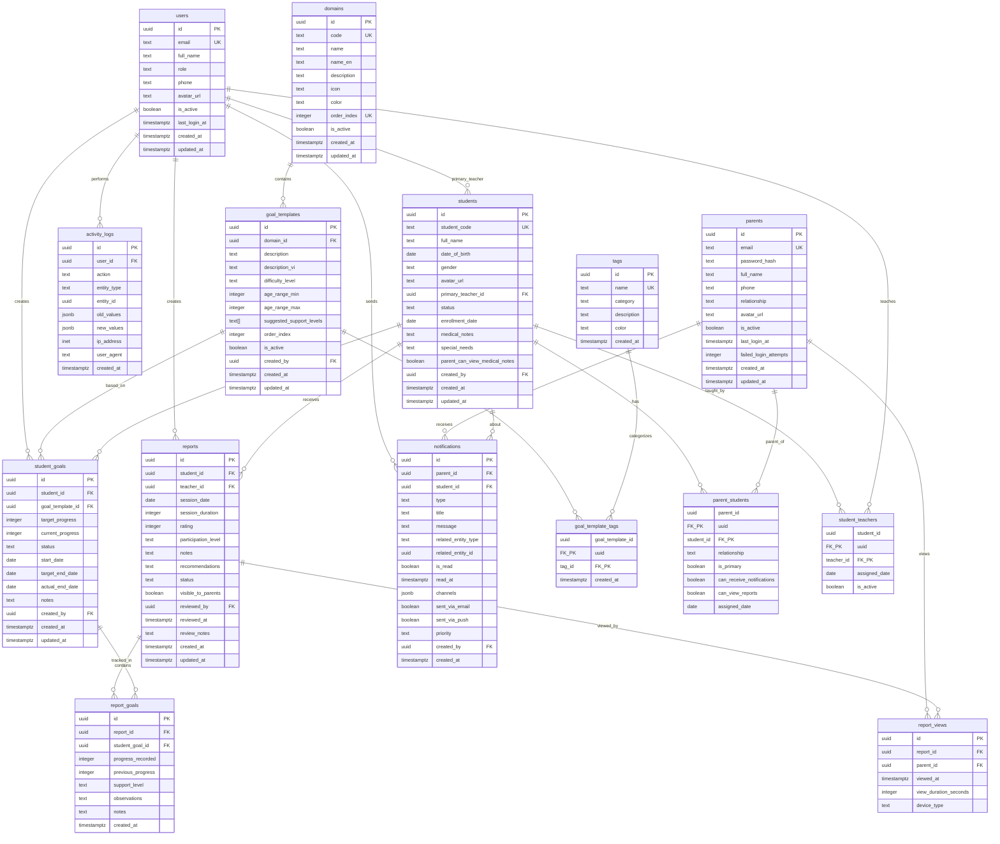

# 🗄️ Database Schema - UMX System

**Dự án:** UMX - Student Intervention Management System  
**Database:** PostgreSQL 15+ (via Supabase)  
**Ngày:** 21 tháng 10, 2025  
**Mục đích:** Tài liệu chi tiết về cấu trúc database, relationships, và field descriptions

---

## 📋 Mục Lục

1. [Tổng Quan Database](#1-tổng-quan-database)
2. [Entity Relationship Diagram](#2-entity-relationship-diagram)
3. [Bảng Dữ Liệu Chi Tiết](#3-bảng-dữ-liệu-chi-tiết)
4. [Relationships Matrix](#4-relationships-matrix)
5. [Indexes & Performance](#5-indexes--performance)
6. [Constraints & Validations](#6-constraints--validations)

---

## 1. Tổng Quan Database

### 📊 Thống Kê Database

- **Tổng số bảng:** 15 tables
- **Core tables:** 10 (users, students, goals, reports)
- **Junction tables:** 4 (many-to-many relationships)
- **Audit tables:** 1 (activity_logs)

### 🎯 Nhóm Bảng Theo Chức Năng

#### Authentication & Users (2 tables)

- `users` - Giáo viên, Admin
- `parents` - Phụ huynh

#### Student Management (3 tables)

- `students` - Thông tin học sinh
- `student_teachers` - Junction: Students ↔ Teachers
- `parent_students` - Junction: Parents ↔ Students

#### Goal Management (5 tables)

- `domains` - 7 lĩnh vực ABA
- `goal_templates` - Thư viện mẫu mục tiêu
- `tags` - Tags phân loại
- `goal_template_tags` - Junction: Templates ↔ Tags
- `student_goals` - Goals được gán cho học sinh

#### Report Management (3 tables)

- `reports` - Báo cáo buổi học
- `report_goals` - Junction + Data: Reports ↔ Goals
- `report_views` - Tracking phụ huynh xem báo cáo

#### Communication (1 table)

- `notifications` - Thông báo cho phụ huynh

#### Audit (1 table)

- `activity_logs` - Lịch sử thay đổi

---

## 2. Entity Relationship Diagram

### 📐 ERD - Mermaid Diagram



---

### 🔗 Relationships Summary

```
users (Teachers/Admins)
  │
  ├──[1:N]──> students (primary_teacher_id)
  ├──[1:N]──> student_teachers (teacher_id)
  ├──[1:N]──> reports (teacher_id)
  ├──[1:N]──> student_goals (created_by)
  ├──[1:N]──> notifications (created_by)
  └──[1:N]──> activity_logs (user_id)

domains (7 fixed records)
  │
  └──[1:N]──> goal_templates (domain_id)

goal_templates (~200 records)
  │
  ├──[1:N]──> student_goals (goal_template_id)
  └──[M:N]──> tags (via goal_template_tags)

students
  │
  ├──[1:N]──> student_goals (student_id)
  ├──[1:N]──> reports (student_id)
  ├──[M:N]──> users (via student_teachers)
  ├──[M:N]──> parents (via parent_students)
  └──[1:N]──> notifications (student_id)

reports
  │
  ├──[1:N]──> report_goals (report_id)
  └──[1:N]──> report_views (report_id)

student_goals
  │
  └──[1:N]──> report_goals (student_goal_id)

parents
  │
  ├──[M:N]──> students (via parent_students)
  ├──[1:N]──> notifications (parent_id)
  └──[1:N]──> report_views (parent_id)
```

---

## 3. Bảng Dữ Liệu Chi Tiết

### 📋 Table 1: `users`

**Mục đích:** Lưu thông tin giáo viên và admin

**Primary Key:** `id` (UUID)

**Foreign Keys:** Không có (root table)

**Unique Constraints:** `email`

#### Fields:

| Field             | Type        | Null | Default           | Description                                   |
| ----------------- | ----------- | ---- | ----------------- | --------------------------------------------- |
| **id**            | UUID        | NO   | gen_random_uuid() | 🔑 **Primary Key** - ID duy nhất của user     |
| **email**         | TEXT        | NO   | -                 | 📧 **Unique** - Email đăng nhập (phải unique) |
| **full_name**     | TEXT        | NO   | -                 | 👤 Họ và tên đầy đủ                           |
| **role**          | TEXT        | NO   | -                 | 🎭 Vai trò: 'admin', 'teacher', 'supervisor'  |
| **phone**         | TEXT        | YES  | NULL              | 📱 Số điện thoại liên hệ                      |
| **avatar_url**    | TEXT        | YES  | NULL              | 🖼️ URL ảnh đại diện (Supabase Storage)        |
| **is_active**     | BOOLEAN     | NO   | true              | ✅ Tài khoản có đang active không             |
| **last_login_at** | TIMESTAMPTZ | YES  | NULL              | 🕐 Thời điểm đăng nhập cuối cùng              |
| **created_at**    | TIMESTAMPTZ | NO   | NOW()             | 📅 Thời điểm tạo tài khoản                    |
| **updated_at**    | TIMESTAMPTZ | NO   | NOW()             | 🔄 Thời điểm cập nhật cuối                    |

**Indexes:**

- `idx_users_role` on `role`
- `idx_users_active` on `is_active` WHERE is_active = true

**Check Constraints:**

- `role` IN ('admin', 'teacher', 'supervisor')

**Sample Data:**

```sql
INSERT INTO users VALUES
('u1111111-1111-1111-1111-111111111111', 'admin@umx.app', 'Admin User', 'admin', '0901234567', NULL, true, NOW(), NOW(), NOW()),
('u2222222-2222-2222-2222-222222222222', 'teacher1@umx.app', 'Hào Trần', 'teacher', '0912345678', NULL, true, NOW(), NOW(), NOW());
```

---

### 📋 Table 2: `domains`

**Mục đích:** Lưu 7 lĩnh vực can thiệp ABA chuẩn

**Primary Key:** `id` (UUID)

**Foreign Keys:** Không có

**Unique Constraints:** `code`, `order_index`

#### Fields:

| Field           | Type        | Null | Default           | Description                                |
| --------------- | ----------- | ---- | ----------------- | ------------------------------------------ |
| **id**          | UUID        | NO   | gen_random_uuid() | 🔑 **Primary Key** - ID của domain         |
| **code**        | TEXT        | NO   | -                 | 🏷️ **Unique** - Mã code domain (UPPERCASE) |
| **name**        | TEXT        | NO   | -                 | 📝 Tên domain (Tiếng Việt)                 |
| **name_en**     | TEXT        | NO   | -                 | 🇬🇧 Tên domain (English)                    |
| **description** | TEXT        | YES  | NULL              | 📄 Mô tả chi tiết domain                   |
| **icon**        | TEXT        | NO   | -                 | 🎨 Icon/Emoji đại diện                     |
| **color**       | TEXT        | NO   | -                 | 🌈 Mã màu hex (e.g., #FF6B6B)              |
| **order_index** | INTEGER     | NO   | -                 | 🔢 **Unique** - Thứ tự hiển thị (1-7)      |
| **is_active**   | BOOLEAN     | NO   | true              | ✅ Domain có active không                  |
| **created_at**  | TIMESTAMPTZ | NO   | NOW()             | 📅 Thời điểm tạo                           |
| **updated_at**  | TIMESTAMPTZ | NO   | NOW()             | 🔄 Thời điểm cập nhật                      |

**Check Constraints:**

- `code` IN ('IMITATION', 'RECEPTIVE_LANGUAGE', 'EXPRESSIVE_LANGUAGE', 'VISUAL_PERFORMANCE', 'PLAY_LEISURE', 'SOCIAL_SKILLS', 'SELF_HELP')

**7 Domains:**

```
1. IMITATION (Bắt chước) - #FF6B6B - 👤
2. RECEPTIVE_LANGUAGE (Ngôn ngữ Receptive) - #4ECDC4 - 👂
3. EXPRESSIVE_LANGUAGE (Ngôn ngữ Expressive) - #45B7D1 - 💬
4. VISUAL_PERFORMANCE (Nhận thức thị giác) - #96CEB4 - 👁️
5. PLAY_LEISURE (Chơi & Giải trí) - #FFEAA7 - 🎮
6. SOCIAL_SKILLS (Kỹ năng Xã hội) - #A29BFE - 🤝
7. SELF_HELP (Tự phục vụ) - #FD79A8 - 🍽️
```

---

### 📋 Table 3: `goal_templates`

**Mục đích:** Thư viện mẫu mục tiêu (Goal Templates Library)

**Primary Key:** `id` (UUID)

**Foreign Keys:**

- `domain_id` → `domains(id)` ON DELETE RESTRICT
- `created_by` → `users(id)` ON DELETE SET NULL

#### Fields:

| Field                        | Type        | Null | Default           | Description                         |
| ---------------------------- | ----------- | ---- | ----------------- | ----------------------------------- |
| **id**                       | UUID        | NO   | gen_random_uuid() | 🔑 **Primary Key**                  |
| **domain_id**                | UUID        | NO   | -                 | 🔗 **Foreign Key** → domains.id     |
| **description**              | TEXT        | NO   | -                 | 📝 Mô tả mục tiêu (English)         |
| **description_vi**           | TEXT        | YES  | NULL              | 📝 Mô tả (Tiếng Việt)               |
| **difficulty_level**         | TEXT        | NO   | -                 | 📊 Độ khó: 'easy', 'medium', 'hard' |
| **age_range_min**            | INTEGER     | YES  | NULL              | 👶 Độ tuổi tối thiểu (tháng)        |
| **age_range_max**            | INTEGER     | YES  | NULL              | 👦 Độ tuổi tối đa (tháng)           |
| **suggested_support_levels** | TEXT[]      | YES  | NULL              | 🤝 Các mức hỗ trợ gợi ý (array)     |
| **order_index**              | INTEGER     | NO   | -                 | 🔢 Thứ tự trong domain              |
| **is_active**                | BOOLEAN     | NO   | true              | ✅ Template có active không         |
| **created_by**               | UUID        | YES  | NULL              | 🔗 **FK** → users.id (admin tạo)    |
| **created_at**               | TIMESTAMPTZ | NO   | NOW()             | 📅 Thời điểm tạo                    |
| **updated_at**               | TIMESTAMPTZ | NO   | NOW()             | 🔄 Thời điểm cập nhật               |

**Indexes:**

- `idx_goal_templates_domain` on `domain_id`
- `idx_goal_templates_difficulty` on `difficulty_level`
- `idx_goal_templates_active` on `(is_active, domain_id, order_index)`

**Check Constraints:**

- `difficulty_level` IN ('easy', 'medium', 'hard')
- `age_range_min` < `age_range_max` (if both not null)

**Example:**

```sql
INSERT INTO goal_templates VALUES
('gt-im-001', 'd1111111...', 'Child can imitate 3 simple play actions with objects',
 'Trẻ có thể bắt chước 3 hành động chơi đơn giản', 'easy', 18, 36,
 ARRAY['verbal', 'modeling'], 1, true, 'u1111111...', NOW(), NOW());
```

---

### 📋 Table 4: `tags`

**Mục đích:** Tags để phân loại goal templates

**Primary Key:** `id` (UUID)

**Foreign Keys:** Không có

**Unique Constraints:** `name`

#### Fields:

| Field           | Type        | Null | Default           | Description                                       |
| --------------- | ----------- | ---- | ----------------- | ------------------------------------------------- |
| **id**          | UUID        | NO   | gen_random_uuid() | 🔑 **Primary Key**                                |
| **name**        | TEXT        | NO   | -                 | 🏷️ **Unique** - Tên tag (e.g., 'motor_imitation') |
| **category**    | TEXT        | NO   | -                 | 📂 Danh mục tag                                   |
| **description** | TEXT        | YES  | NULL              | 📄 Mô tả tag                                      |
| **color**       | TEXT        | YES  | NULL              | 🌈 Màu hex cho UI                                 |
| **created_at**  | TIMESTAMPTZ | NO   | NOW()             | 📅 Thời điểm tạo                                  |

**Check Constraints:**

- `category` IN ('imitation', 'receptive', 'expressive', 'visual', 'play', 'social', 'self_help', 'motor', 'support', 'age')

**Example Categories:**

```
- imitation: motor_imitation, vocal_imitation, object_imitation
- receptive: following_directions, object_identification
- motor: gross_motor, fine_motor
- support: verbal_prompt, modeling, physical_prompt
```

---

### 📋 Table 5: `goal_template_tags`

**Mục đích:** Junction table - Many-to-Many relationship giữa goal_templates và tags

**Primary Key:** Composite `(goal_template_id, tag_id)`

**Foreign Keys:**

- `goal_template_id` → `goal_templates(id)` ON DELETE CASCADE
- `tag_id` → `tags(id)` ON DELETE CASCADE

#### Fields:

| Field                | Type        | Null | Default | Description                          |
| -------------------- | ----------- | ---- | ------- | ------------------------------------ |
| **goal_template_id** | UUID        | NO   | -       | 🔑🔗 **PK + FK** → goal_templates.id |
| **tag_id**           | UUID        | NO   | -       | 🔑🔗 **PK + FK** → tags.id           |
| **created_at**       | TIMESTAMPTZ | NO   | NOW()   | 📅 Thời điểm gán tag                 |

**Indexes:**

- `idx_gtt_template` on `goal_template_id`
- `idx_gtt_tag` on `tag_id`

**Example:**

```sql
-- Goal template "Imitate 3 play actions" có các tags:
INSERT INTO goal_template_tags VALUES
('gt-im-001', 'tag-motor-imitation', NOW()),
('gt-im-001', 'tag-object-manipulation', NOW()),
('gt-im-001', 'tag-play-based', NOW());
```

---

### 📋 Table 6: `students`

**Mục đích:** Lưu thông tin học sinh

**Primary Key:** `id` (UUID)

**Foreign Keys:**

- `primary_teacher_id` → `users(id)` ON DELETE SET NULL
- `created_by` → `users(id)` ON DELETE SET NULL

**Unique Constraints:** `student_code`

#### Fields:

| Field                             | Type        | Null | Default           | Description                                      |
| --------------------------------- | ----------- | ---- | ----------------- | ------------------------------------------------ |
| **id**                            | UUID        | NO   | gen_random_uuid() | 🔑 **Primary Key**                               |
| **student_code**                  | TEXT        | NO   | -                 | 🏷️ **Unique** - Mã học sinh (e.g., ST001)        |
| **full_name**                     | TEXT        | NO   | -                 | 👤 Họ và tên học sinh                            |
| **date_of_birth**                 | DATE        | NO   | -                 | 🎂 Ngày sinh                                     |
| **gender**                        | TEXT        | YES  | NULL              | ⚧️ Giới tính: 'male', 'female', 'other'          |
| **avatar_url**                    | TEXT        | YES  | NULL              | 🖼️ URL ảnh đại diện                              |
| **primary_teacher_id**            | UUID        | YES  | NULL              | 🔗 **FK** → users.id (giáo viên chính)           |
| **status**                        | TEXT        | NO   | 'active'          | 📊 Trạng thái: 'active', 'inactive', 'graduated' |
| **enrollment_date**               | DATE        | NO   | CURRENT_DATE      | 📅 Ngày nhập học                                 |
| **medical_notes**                 | TEXT        | YES  | NULL              | 🏥 Ghi chú y tế                                  |
| **special_needs**                 | TEXT        | YES  | NULL              | ♿ Nhu cầu đặc biệt                              |
| **parent_can_view_medical_notes** | BOOLEAN     | NO   | false             | 👁️ Phụ huynh có thể xem y tế không               |
| **created_by**                    | UUID        | YES  | NULL              | 🔗 **FK** → users.id (ai tạo)                    |
| **created_at**                    | TIMESTAMPTZ | NO   | NOW()             | 📅 Thời điểm tạo                                 |
| **updated_at**                    | TIMESTAMPTZ | NO   | NOW()             | 🔄 Thời điểm cập nhật                            |

**Indexes:**

- `idx_students_teacher` on `primary_teacher_id`
- `idx_students_status` on `status` WHERE status = 'active'
- `idx_students_code` on `student_code`
- `idx_students_name_search` on `to_tsvector('english', full_name)` (Full-text search)

**Check Constraints:**

- `gender` IN ('male', 'female', 'other')
- `status` IN ('active', 'inactive', 'graduated')
- `date_of_birth` <= CURRENT_DATE

---

### 📋 Table 7: `student_teachers`

**Mục đích:** Junction table - Many-to-Many giữa students và teachers (support teachers)

**Primary Key:** Composite `(student_id, teacher_id)`

**Foreign Keys:**

- `student_id` → `students(id)` ON DELETE CASCADE
- `teacher_id` → `users(id)` ON DELETE CASCADE

#### Fields:

| Field             | Type    | Null | Default      | Description                    |
| ----------------- | ------- | ---- | ------------ | ------------------------------ |
| **student_id**    | UUID    | NO   | -            | 🔑🔗 **PK + FK** → students.id |
| **teacher_id**    | UUID    | NO   | -            | 🔑🔗 **PK + FK** → users.id    |
| **assigned_date** | DATE    | NO   | CURRENT_DATE | 📅 Ngày gán giáo viên          |
| **is_active**     | BOOLEAN | NO   | true         | ✅ Assignment có active không  |

**Use Case:**

- Học sinh có 1 primary_teacher (trong `students` table)
- Nhưng có thể có nhiều support teachers (trong `student_teachers` table)

**Example:**

```sql
-- Student ST001 có primary teacher là Teacher A
-- Và có support teacher là Teacher B, Teacher C
INSERT INTO student_teachers VALUES
('student-001', 'teacher-b', '2025-01-01', true),
('student-001', 'teacher-c', '2025-02-01', true);
```

---

### 📋 Table 8: `student_goals`

**Mục đích:** Goals được gán cho học sinh cụ thể (từ goal_templates)

**Primary Key:** `id` (UUID)

**Foreign Keys:**

- `student_id` → `students(id)` ON DELETE CASCADE
- `goal_template_id` → `goal_templates(id)` ON DELETE RESTRICT
- `created_by` → `users(id)` ON DELETE SET NULL

#### Fields:

| Field                | Type        | Null | Default           | Description                          |
| -------------------- | ----------- | ---- | ----------------- | ------------------------------------ |
| **id**               | UUID        | NO   | gen_random_uuid() | 🔑 **Primary Key**                   |
| **student_id**       | UUID        | NO   | -                 | 🔗 **FK** → students.id              |
| **goal_template_id** | UUID        | NO   | -                 | 🔗 **FK** → goal_templates.id        |
| **target_progress**  | INTEGER     | NO   | 100               | 🎯 Mục tiêu % (50-100)               |
| **current_progress** | INTEGER     | NO   | 0                 | 📊 Tiến độ hiện tại % (0-100)        |
| **status**           | TEXT        | NO   | 'not_started'     | 📌 Trạng thái goal                   |
| **start_date**       | DATE        | NO   | CURRENT_DATE      | 📅 Ngày bắt đầu                      |
| **target_end_date**  | DATE        | YES  | NULL              | 🎯 Ngày dự kiến hoàn thành           |
| **actual_end_date**  | DATE        | YES  | NULL              | ✅ Ngày hoàn thành thực tế           |
| **notes**            | TEXT        | YES  | NULL              | 📝 Ghi chú đặc biệt                  |
| **created_by**       | UUID        | NO   | -                 | 🔗 **FK** → users.id (giáo viên tạo) |
| **created_at**       | TIMESTAMPTZ | NO   | NOW()             | 📅 Thời điểm tạo                     |
| **updated_at**       | TIMESTAMPTZ | NO   | NOW()             | 🔄 Thời điểm cập nhật                |

**Indexes:**

- `idx_student_goals_student` on `(student_id, status)`
- `idx_student_goals_template` on `goal_template_id`
- `idx_student_goals_status` on `status`

**Check Constraints:**

- `status` IN ('not_started', 'in_progress', 'completed', 'on_hold', 'discontinued')
- `target_progress` BETWEEN 50 AND 100
- `current_progress` BETWEEN 0 AND 100
- `target_end_date` >= `start_date` (if not null)
- `actual_end_date` >= `start_date` (if not null)

**Status Flow:**

```
not_started → in_progress → completed
                    ↓
                 on_hold → in_progress
                    ↓
              discontinued (end)
```

---

### 📋 Table 9: `reports`

**Mục đích:** Báo cáo tiến độ buổi học

**Primary Key:** `id` (UUID)

**Foreign Keys:**

- `student_id` → `students(id)` ON DELETE CASCADE
- `teacher_id` → `users(id)` ON DELETE RESTRICT
- `reviewed_by` → `users(id)` ON DELETE SET NULL

#### Fields:

| Field                   | Type        | Null | Default           | Description                              |
| ----------------------- | ----------- | ---- | ----------------- | ---------------------------------------- |
| **id**                  | UUID        | NO   | gen_random_uuid() | 🔑 **Primary Key**                       |
| **student_id**          | UUID        | NO   | -                 | 🔗 **FK** → students.id                  |
| **teacher_id**          | UUID        | NO   | -                 | 🔗 **FK** → users.id (giáo viên tạo)     |
| **session_date**        | DATE        | NO   | -                 | 📅 Ngày buổi học                         |
| **session_duration**    | INTEGER     | NO   | -                 | ⏱️ Thời lượng (phút)                     |
| **rating**              | INTEGER     | NO   | -                 | ⭐ Đánh giá 1-5 sao                      |
| **participation_level** | TEXT        | NO   | -                 | 📊 Mức tham gia: 'high', 'medium', 'low' |
| **notes**               | TEXT        | YES  | NULL              | 📝 Ghi chú chung                         |
| **recommendations**     | TEXT        | YES  | NULL              | 💡 Khuyến nghị cho phụ huynh             |
| **status**              | TEXT        | NO   | 'draft'           | 📌 'draft', 'submitted', 'reviewed'      |
| **visible_to_parents**  | BOOLEAN     | NO   | true              | 👁️ Phụ huynh có thể xem không            |
| **reviewed_by**         | UUID        | YES  | NULL              | 🔗 **FK** → users.id (supervisor review) |
| **reviewed_at**         | TIMESTAMPTZ | YES  | NULL              | 📅 Thời điểm review                      |
| **review_notes**        | TEXT        | YES  | NULL              | 📝 Ghi chú review                        |
| **created_at**          | TIMESTAMPTZ | NO   | NOW()             | 📅 Thời điểm tạo                         |
| **updated_at**          | TIMESTAMPTZ | NO   | NOW()             | 🔄 Thời điểm cập nhật                    |

**Indexes:**

- `idx_reports_student` on `(student_id, session_date DESC)`
- `idx_reports_teacher` on `(teacher_id, session_date DESC)`
- `idx_reports_status` on `(status, session_date DESC)`
- `idx_reports_date` on `session_date DESC`

**Check Constraints:**

- `session_duration` > 0
- `rating` BETWEEN 1 AND 5
- `participation_level` IN ('high', 'medium', 'low')
- `status` IN ('draft', 'submitted', 'reviewed')
- `session_date` <= CURRENT_DATE

**Status Flow:**

```
draft → submitted → reviewed
  ↓         ↓
delete   edit (add review_notes)
```

---

### 📋 Table 10: `report_goals`

**Mục đích:** Junction table + Progress data - Ghi nhận goals trong mỗi report

**Primary Key:** `id` (UUID)

**Foreign Keys:**

- `report_id` → `reports(id)` ON DELETE CASCADE
- `student_goal_id` → `student_goals(id)` ON DELETE RESTRICT

**Unique Constraints:** `(report_id, student_goal_id)`

#### Fields:

| Field                 | Type        | Null | Default           | Description                  |
| --------------------- | ----------- | ---- | ----------------- | ---------------------------- |
| **id**                | UUID        | NO   | gen_random_uuid() | 🔑 **Primary Key**           |
| **report_id**         | UUID        | NO   | -                 | 🔗 **FK** → reports.id       |
| **student_goal_id**   | UUID        | NO   | -                 | 🔗 **FK** → student_goals.id |
| **progress_recorded** | INTEGER     | NO   | -                 | 📊 Tiến độ ghi nhận (0-100%) |
| **previous_progress** | INTEGER     | NO   | -                 | 📈 Tiến độ trước đó (0-100%) |
| **support_level**     | TEXT        | NO   | -                 | 🤝 Mức hỗ trợ đã dùng        |
| **observations**      | TEXT        | YES  | NULL              | 👀 Quan sát chi tiết         |
| **notes**             | TEXT        | YES  | NULL              | 📝 Ghi chú bổ sung           |
| **created_at**        | TIMESTAMPTZ | NO   | NOW()             | 📅 Thời điểm ghi nhận        |

**Indexes:**

- `idx_report_goals_report` on `report_id`
- `idx_report_goals_student_goal` on `student_goal_id`

**Check Constraints:**

- `progress_recorded` BETWEEN 0 AND 100
- `previous_progress` BETWEEN 0 AND 100
- `support_level` IN ('independent', 'verbal', 'modeling', 'physical', 'full_physical')

**Support Levels:**

```
1. independent: Độc lập, không cần hỗ trợ
2. verbal: Nhắc nhở bằng lời nói
3. modeling: Làm mẫu cho trẻ bắt chước
4. physical: Hỗ trợ vật lý một phần
5. full_physical: Hỗ trợ vật lý toàn bộ (hand-over-hand)
```

**Unique Constraint:** Mỗi goal chỉ được ghi nhận 1 lần trong 1 report

---

### 📋 Table 11: `parents`

**Mục đích:** Tài khoản phụ huynh

**Primary Key:** `id` (UUID)

**Foreign Keys:** Không có

**Unique Constraints:** `email`

#### Fields:

| Field                     | Type        | Null | Default           | Description                                         |
| ------------------------- | ----------- | ---- | ----------------- | --------------------------------------------------- |
| **id**                    | UUID        | NO   | gen_random_uuid() | 🔑 **Primary Key**                                  |
| **email**                 | TEXT        | NO   | -                 | 📧 **Unique** - Email đăng nhập                     |
| **password_hash**         | TEXT        | NO   | -                 | 🔒 Mật khẩu đã hash                                 |
| **full_name**             | TEXT        | NO   | -                 | 👤 Họ tên phụ huynh                                 |
| **phone**                 | TEXT        | YES  | NULL              | 📱 Số điện thoại                                    |
| **relationship**          | TEXT        | YES  | NULL              | 👨‍👩‍👧 Quan hệ: 'mother', 'father', 'guardian', 'other' |
| **avatar_url**            | TEXT        | YES  | NULL              | 🖼️ URL ảnh đại diện                                 |
| **is_active**             | BOOLEAN     | NO   | true              | ✅ Tài khoản active                                 |
| **last_login_at**         | TIMESTAMPTZ | YES  | NULL              | 🕐 Lần login cuối                                   |
| **failed_login_attempts** | INTEGER     | NO   | 0                 | 🚫 Số lần login sai (security)                      |
| **created_at**            | TIMESTAMPTZ | NO   | NOW()             | 📅 Thời điểm tạo                                    |
| **updated_at**            | TIMESTAMPTZ | NO   | NOW()             | 🔄 Thời điểm cập nhật                               |

**Indexes:**

- `idx_parents_email` on `email` WHERE is_active = true

**Check Constraints:**

- `relationship` IN ('mother', 'father', 'guardian', 'other')

**Security:**

- `failed_login_attempts` >= 5 → Lock account
- Password hashed with bcrypt/argon2

---

### 📋 Table 12: `parent_students`

**Mục đích:** Junction table - Many-to-Many giữa parents và students

**Primary Key:** Composite `(parent_id, student_id)`

**Foreign Keys:**

- `parent_id` → `parents(id)` ON DELETE CASCADE
- `student_id` → `students(id)` ON DELETE CASCADE

#### Fields:

| Field                         | Type    | Null | Default      | Description                                |
| ----------------------------- | ------- | ---- | ------------ | ------------------------------------------ |
| **parent_id**                 | UUID    | NO   | -            | 🔑🔗 **PK + FK** → parents.id              |
| **student_id**                | UUID    | NO   | -            | 🔑🔗 **PK + FK** → students.id             |
| **relationship**              | TEXT    | NO   | -            | 👨‍👩‍👧 Quan hệ: 'mother', 'father', 'guardian' |
| **is_primary**                | BOOLEAN | NO   | false        | ⭐ Phụ huynh chính (primary contact)       |
| **can_receive_notifications** | BOOLEAN | NO   | true         | 🔔 Nhận thông báo                          |
| **can_view_reports**          | BOOLEAN | NO   | true         | 👁️ Xem báo cáo                             |
| **assigned_date**             | DATE    | NO   | CURRENT_DATE | 📅 Ngày gán                                |

**Indexes:**

- `idx_parent_students_parent` on `parent_id`
- `idx_parent_students_student` on `student_id`

**Use Case:**

- 1 học sinh có thể có nhiều phụ huynh (mẹ, bố, ông bà)
- 1 phụ huynh có thể có nhiều con

**Example:**

```sql
-- Học sinh ST001 có 2 phụ huynh
INSERT INTO parent_students VALUES
('parent-mom-001', 'student-001', 'mother', true, true, true, '2025-01-01'),
('parent-dad-001', 'student-001', 'father', false, true, true, '2025-01-01');
```

---

### 📋 Table 13: `report_views`

**Mục đích:** Tracking khi phụ huynh xem báo cáo

**Primary Key:** `id` (UUID)

**Foreign Keys:**

- `report_id` → `reports(id)` ON DELETE CASCADE
- `parent_id` → `parents(id)` ON DELETE CASCADE

**Unique Constraints:** `(report_id, parent_id)`

#### Fields:

| Field                     | Type        | Null | Default           | Description                  |
| ------------------------- | ----------- | ---- | ----------------- | ---------------------------- |
| **id**                    | UUID        | NO   | gen_random_uuid() | 🔑 **Primary Key**           |
| **report_id**             | UUID        | NO   | -                 | 🔗 **FK** → reports.id       |
| **parent_id**             | UUID        | NO   | -                 | 🔗 **FK** → parents.id       |
| **viewed_at**             | TIMESTAMPTZ | NO   | NOW()             | 👁️ Thời điểm xem (lần đầu)   |
| **view_duration_seconds** | INTEGER     | NO   | 0                 | ⏱️ Tổng thời gian xem (giây) |
| **device_type**           | TEXT        | YES  | NULL              | 📱 'ios', 'android', 'web'   |

**Indexes:**

- `idx_report_views_report` on `report_id`
- `idx_report_views_parent` on `(parent_id, viewed_at DESC)`

**Use Case:**

- Giáo viên biết phụ huynh đã xem báo cáo chưa
- Thống kê engagement của phụ huynh

**Unique Constraint:** Mỗi phụ huynh chỉ có 1 record view cho 1 report (update view_duration nếu xem lại)

---

### 📋 Table 14: `notifications`

**Mục đích:** Thông báo cho phụ huynh

**Primary Key:** `id` (UUID)

**Foreign Keys:**

- `parent_id` → `parents(id)` ON DELETE CASCADE
- `student_id` → `students(id)` ON DELETE CASCADE (optional)
- `created_by` → `users(id)` ON DELETE SET NULL

#### Fields:

| Field                   | Type        | Null | Default                         | Description                                      |
| ----------------------- | ----------- | ---- | ------------------------------- | ------------------------------------------------ |
| **id**                  | UUID        | NO   | gen_random_uuid()               | 🔑 **Primary Key**                               |
| **parent_id**           | UUID        | NO   | -                               | 🔗 **FK** → parents.id                           |
| **student_id**          | UUID        | YES  | NULL                            | 🔗 **FK** → students.id (liên quan học sinh nào) |
| **type**                | TEXT        | NO   | -                               | 📌 Loại notification                             |
| **title**               | TEXT        | NO   | -                               | 📰 Tiêu đề                                       |
| **message**             | TEXT        | NO   | -                               | 💬 Nội dung                                      |
| **related_entity_type** | TEXT        | YES  | NULL                            | 🔗 'report', 'goal', 'announcement'              |
| **related_entity_id**   | UUID        | YES  | NULL                            | 🔗 ID của entity liên quan                       |
| **is_read**             | BOOLEAN     | NO   | false                           | ✅ Đã đọc chưa                                   |
| **read_at**             | TIMESTAMPTZ | YES  | NULL                            | 📅 Thời điểm đọc                                 |
| **channels**            | JSONB       | NO   | '{"email": true, "push": true}' | 📡 Kênh gửi                                      |
| **sent_via_email**      | BOOLEAN     | NO   | false                           | 📧 Đã gửi email chưa                             |
| **sent_via_push**       | BOOLEAN     | NO   | false                           | 📱 Đã gửi push chưa                              |
| **priority**            | TEXT        | NO   | 'normal'                        | ⚡ Độ ưu tiên                                    |
| **created_by**          | UUID        | YES  | NULL                            | 🔗 **FK** → users.id (ai tạo)                    |
| **created_at**          | TIMESTAMPTZ | NO   | NOW()                           | 📅 Thời điểm tạo                                 |

**Indexes:**

- `idx_notifications_parent` on `(parent_id, is_read, created_at DESC)`
- `idx_notifications_unread` on `parent_id` WHERE is_read = false
- `idx_notifications_type` on `(type, created_at DESC)`

**Check Constraints:**

- `type` IN ('new_report', 'goal_completed', 'announcement', 'schedule_change', 'reminder')
- `related_entity_type` IN ('report', 'goal', 'announcement')
- `priority` IN ('low', 'normal', 'high', 'urgent')

**Notification Types:**

```
1. new_report: Báo cáo mới được tạo
2. goal_completed: Mục tiêu hoàn thành
3. announcement: Thông báo chung từ trường/giáo viên
4. schedule_change: Thay đổi lịch học
5. reminder: Nhắc nhở (e.g., upcoming session)
```

---

### 📋 Table 15: `activity_logs`

**Mục đích:** Audit trail - Lưu lịch sử thay đổi

**Primary Key:** `id` (UUID)

**Foreign Keys:**

- `user_id` → `users(id)` ON DELETE SET NULL

#### Fields:

| Field           | Type        | Null | Default           | Description                                        |
| --------------- | ----------- | ---- | ----------------- | -------------------------------------------------- |
| **id**          | UUID        | NO   | gen_random_uuid() | 🔑 **Primary Key**                                 |
| **user_id**     | UUID        | YES  | NULL              | 🔗 **FK** → users.id (ai thực hiện)                |
| **action**      | TEXT        | NO   | -                 | 🎬 'create', 'update', 'delete', 'login', 'logout' |
| **entity_type** | TEXT        | NO   | -                 | 📦 Loại entity: 'student', 'goal', 'report'        |
| **entity_id**   | UUID        | YES  | NULL              | 🔗 ID của entity                                   |
| **old_values**  | JSONB       | YES  | NULL              | 📜 Giá trị cũ (trước update)                       |
| **new_values**  | JSONB       | YES  | NULL              | 📝 Giá trị mới (sau update)                        |
| **ip_address**  | INET        | YES  | NULL              | 🌐 IP address                                      |
| **user_agent**  | TEXT        | YES  | NULL              | 📱 User agent string                               |
| **created_at**  | TIMESTAMPTZ | NO   | NOW()             | 📅 Thời điểm thực hiện                             |

**Indexes:**

- `idx_activity_logs_user` on `(user_id, created_at DESC)`
- `idx_activity_logs_entity` on `(entity_type, entity_id, created_at DESC)`
- `idx_activity_logs_date` on `created_at DESC`

**Check Constraints:**

- `action` IN ('create', 'update', 'delete', 'login', 'logout')

**Use Cases:**

- Audit compliance
- Debug issues
- Track who changed what
- Security monitoring

**Example:**

```sql
INSERT INTO activity_logs VALUES
(gen_random_uuid(), 'teacher-001', 'update', 'student_goal', 'goal-001',
 '{"current_progress": 50}', '{"current_progress": 75}',
 '192.168.1.1', 'Mozilla/5.0...', NOW());
```

---

## 4. Relationships Matrix

### 🔗 Foreign Key Relationships

| Child Table            | Foreign Key        | Parent Table   | Parent Column | On Delete |
| ---------------------- | ------------------ | -------------- | ------------- | --------- |
| **goal_templates**     | domain_id          | domains        | id            | RESTRICT  |
| **goal_templates**     | created_by         | users          | id            | SET NULL  |
| **goal_template_tags** | goal_template_id   | goal_templates | id            | CASCADE   |
| **goal_template_tags** | tag_id             | tags           | id            | CASCADE   |
| **students**           | primary_teacher_id | users          | id            | SET NULL  |
| **students**           | created_by         | users          | id            | SET NULL  |
| **student_teachers**   | student_id         | students       | id            | CASCADE   |
| **student_teachers**   | teacher_id         | users          | id            | CASCADE   |
| **student_goals**      | student_id         | students       | id            | CASCADE   |
| **student_goals**      | goal_template_id   | goal_templates | id            | RESTRICT  |
| **student_goals**      | created_by         | users          | id            | SET NULL  |
| **reports**            | student_id         | students       | id            | CASCADE   |
| **reports**            | teacher_id         | users          | id            | RESTRICT  |
| **reports**            | reviewed_by        | users          | id            | SET NULL  |
| **report_goals**       | report_id          | reports        | id            | CASCADE   |
| **report_goals**       | student_goal_id    | student_goals  | id            | RESTRICT  |
| **parent_students**    | parent_id          | parents        | id            | CASCADE   |
| **parent_students**    | student_id         | students       | id            | CASCADE   |
| **report_views**       | report_id          | reports        | id            | CASCADE   |
| **report_views**       | parent_id          | parents        | id            | CASCADE   |
| **notifications**      | parent_id          | parents        | id            | CASCADE   |
| **notifications**      | student_id         | students       | id            | CASCADE   |
| **notifications**      | created_by         | users          | id            | SET NULL  |
| **activity_logs**      | user_id            | users          | id            | SET NULL  |

### 📊 Cardinality Summary

```
One-to-Many (1:N):
- users → students (primary_teacher)
- users → reports (teacher)
- users → student_goals (created_by)
- domains → goal_templates
- goal_templates → student_goals
- students → student_goals
- students → reports
- students → notifications
- reports → report_goals
- student_goals → report_goals
- reports → report_views
- parents → notifications
- parents → report_views

Many-to-Many (M:N):
- goal_templates ↔ tags (via goal_template_tags)
- students ↔ users (via student_teachers)
- parents ↔ students (via parent_students)
```

---

## 5. Indexes & Performance

### 🚀 Index Strategy

#### Primary Indexes (Auto-created)

```sql
-- Every table has PK index
CREATE INDEX automatically on all PRIMARY KEY columns
```

#### Foreign Key Indexes

```sql
-- For efficient JOINs
CREATE INDEX idx_goal_templates_domain ON goal_templates(domain_id);
CREATE INDEX idx_students_teacher ON students(primary_teacher_id);
CREATE INDEX idx_student_goals_student ON student_goals(student_id, status);
CREATE INDEX idx_reports_student ON reports(student_id, session_date DESC);
CREATE INDEX idx_report_goals_report ON report_goals(report_id);
```

#### Search Indexes

```sql
-- Full-text search on student names
CREATE INDEX idx_students_name_search
  ON students USING gin(to_tsvector('english', full_name));
```

#### Composite Indexes

```sql
-- For common query patterns
CREATE INDEX idx_student_goals_student_status
  ON student_goals(student_id, status);

CREATE INDEX idx_reports_student_date
  ON reports(student_id, session_date DESC);

CREATE INDEX idx_notifications_parent_unread
  ON notifications(parent_id) WHERE is_read = false;
```

#### Partial Indexes

```sql
-- Index only active records
CREATE INDEX idx_users_active
  ON users(is_active) WHERE is_active = true;

CREATE INDEX idx_students_active
  ON students(status) WHERE status = 'active';
```

---

## 6. Constraints & Validations

### ✅ Check Constraints Summary

```sql
-- users
CHECK (role IN ('admin', 'teacher', 'supervisor'))

-- domains
CHECK (code IN ('IMITATION', 'RECEPTIVE_LANGUAGE', ...))

-- goal_templates
CHECK (difficulty_level IN ('easy', 'medium', 'hard'))
CHECK (age_range_min < age_range_max)

-- students
CHECK (gender IN ('male', 'female', 'other'))
CHECK (status IN ('active', 'inactive', 'graduated'))
CHECK (date_of_birth <= CURRENT_DATE)

-- student_goals
CHECK (status IN ('not_started', 'in_progress', 'completed', 'on_hold', 'discontinued'))
CHECK (target_progress BETWEEN 50 AND 100)
CHECK (current_progress BETWEEN 0 AND 100)
CHECK (target_end_date >= start_date)

-- reports
CHECK (session_duration > 0)
CHECK (rating BETWEEN 1 AND 5)
CHECK (participation_level IN ('high', 'medium', 'low'))
CHECK (status IN ('draft', 'submitted', 'reviewed'))
CHECK (session_date <= CURRENT_DATE)

-- report_goals
CHECK (progress_recorded BETWEEN 0 AND 100)
CHECK (previous_progress BETWEEN 0 AND 100)
CHECK (support_level IN ('independent', 'verbal', 'modeling', 'physical', 'full_physical'))

-- parents
CHECK (relationship IN ('mother', 'father', 'guardian', 'other'))

-- notifications
CHECK (type IN ('new_report', 'goal_completed', 'announcement', 'schedule_change', 'reminder'))
CHECK (priority IN ('low', 'normal', 'high', 'urgent'))

-- activity_logs
CHECK (action IN ('create', 'update', 'delete', 'login', 'logout'))
```

### 🔒 Unique Constraints Summary

```sql
-- Single column unique
users.email
domains.code
domains.order_index
goal_templates.name (implicit via index)
tags.name
students.student_code
parents.email

-- Composite unique (Junction tables)
(goal_template_tags.goal_template_id, goal_template_tags.tag_id)
(student_teachers.student_id, student_teachers.teacher_id)
(parent_students.parent_id, parent_students.student_id)
(report_goals.report_id, report_goals.student_goal_id)
(report_views.report_id, report_views.parent_id)
```

---

## 📊 Data Flow Examples

### Example 1: Tạo Goal cho Student

```
1. Teacher chọn Student (students table)
   ↓
2. Teacher chọn Domain (domains table)
   ↓
3. Teacher chọn Goal Template (goal_templates table)
   ↓
4. Teacher cấu hình (target_progress, start_date, notes)
   ↓
5. INSERT INTO student_goals
   - student_id: từ step 1
   - goal_template_id: từ step 3
   - target_progress: 100
   - current_progress: 0
   - status: 'not_started'
   - created_by: teacher.id
   ↓
6. INSERT INTO activity_logs (audit trail)
```

### Example 2: Tạo Report

```
1. Teacher chọn Student (students table)
   ↓
2. Teacher nhập session info (date, duration, rating, participation)
   ↓
3. Teacher chọn Goals (student_goals table WHERE student_id AND status IN ('not_started', 'in_progress'))
   ↓
4. Teacher ghi progress cho từng goal
   - progress_recorded
   - support_level
   - observations
   ↓
5. BEGIN TRANSACTION
   5.1. INSERT INTO reports (session info)
   5.2. FOR EACH selected goal:
        - INSERT INTO report_goals
        - UPDATE student_goals.current_progress
        - IF progress >= target_progress THEN
            UPDATE student_goals.status = 'completed'
   5.3. IF status = 'submitted' THEN
        - SELECT parents via parent_students
        - INSERT INTO notifications (for each parent)
   5.4. INSERT INTO activity_logs
   COMMIT
```

### Example 3: Parent xem Report

```
1. Parent login (parents table)
   ↓
2. Query children:
   SELECT students FROM parent_students WHERE parent_id = ?
   ↓
3. Query reports:
   SELECT reports WHERE student_id IN (children_ids)
     AND visible_to_parents = true
     AND status = 'submitted'
   ↓
4. Parent tap vào report
   ↓
5. UPSERT INTO report_views
   - report_id
   - parent_id
   - viewed_at = NOW()
   ↓
6. UPDATE notifications SET is_read = true
   WHERE parent_id = ?
     AND related_entity_id = report_id
```

---

## 📚 Query Examples

### Common Queries

#### 1. Lấy tất cả students của 1 teacher

```sql
SELECT s.*,
       COUNT(DISTINCT sg.id) as total_goals,
       AVG(r.rating) as avg_rating
FROM students s
LEFT JOIN student_goals sg ON s.id = sg.student_id
LEFT JOIN reports r ON s.id = r.student_id
WHERE s.primary_teacher_id = 'teacher-id'
   OR EXISTS (
     SELECT 1 FROM student_teachers st
     WHERE st.student_id = s.id
       AND st.teacher_id = 'teacher-id'
   )
GROUP BY s.id
ORDER BY s.full_name;
```

#### 2. Lấy goals của student (grouped by domain)

```sql
SELECT
  d.name as domain_name,
  d.color as domain_color,
  sg.*,
  gt.description
FROM student_goals sg
JOIN goal_templates gt ON sg.goal_template_id = gt.id
JOIN domains d ON gt.domain_id = d.id
WHERE sg.student_id = 'student-id'
  AND sg.status IN ('not_started', 'in_progress')
ORDER BY d.order_index, sg.start_date DESC;
```

#### 3. Lấy report với full details

```sql
SELECT
  r.*,
  s.full_name as student_name,
  u.full_name as teacher_name,
  json_agg(
    json_build_object(
      'goal_id', rg.student_goal_id,
      'description', gt.description,
      'domain', d.name,
      'progress_recorded', rg.progress_recorded,
      'previous_progress', rg.previous_progress,
      'support_level', rg.support_level,
      'observations', rg.observations
    )
  ) as goals
FROM reports r
JOIN students s ON r.student_id = s.id
JOIN users u ON r.teacher_id = u.id
LEFT JOIN report_goals rg ON r.id = rg.report_id
LEFT JOIN student_goals sg ON rg.student_goal_id = sg.id
LEFT JOIN goal_templates gt ON sg.goal_template_id = gt.id
LEFT JOIN domains d ON gt.domain_id = d.id
WHERE r.id = 'report-id'
GROUP BY r.id, s.full_name, u.full_name;
```

#### 4. Parent xem notifications chưa đọc

```sql
SELECT n.*,
       s.full_name as student_name,
       s.avatar_url as student_avatar
FROM notifications n
LEFT JOIN students s ON n.student_id = s.id
WHERE n.parent_id = 'parent-id'
  AND n.is_read = false
ORDER BY
  CASE n.priority
    WHEN 'urgent' THEN 1
    WHEN 'high' THEN 2
    WHEN 'normal' THEN 3
    WHEN 'low' THEN 4
  END,
  n.created_at DESC;
```

---

**Document Version:** 1.0  
**Last Updated:** October 21, 2025  
**Status:** ✅ Complete Database Schema Documentation

---

## 🔗 Related Documents

- [BACKEND.md](../BACKEND.md) - Backend architecture & API
- [DOMAINS_AND_GOALS_DATA.md](./DOMAINS_AND_GOALS_DATA.md) - Sample data for 7 domains
- [FRONTEND_GUIDE_VI.md](../FRONTEND_GUIDE_VI.md) - Frontend design guide
