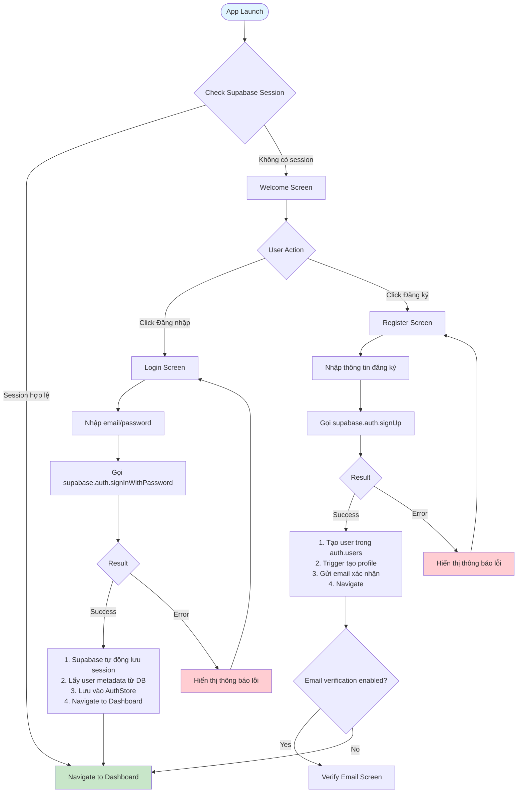
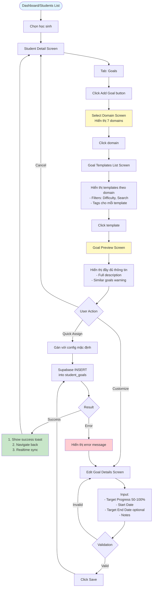
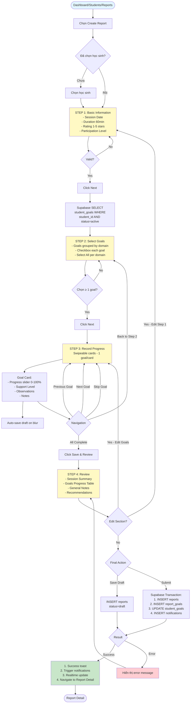
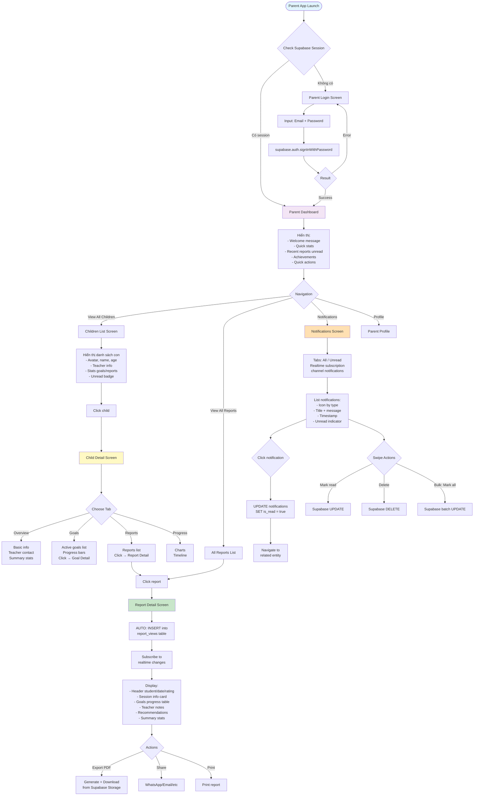

# 📱 UMX - Tài Liệu Frontend (Tiếng Việt)

**Dự án:** UMX - Hệ Thống Quản Lý Can Thiệp Học Sinh  
**Ngày:** 21 tháng 10, 2025  
**Phiên bản:** 1.0  
**Mục đích:** Hướng dẫn chi tiết frontend cho developers

---

## 📋 Mục Lục

1. [Tổng Quan Hệ Thống](#1-tổng-quan-hệ-thống)
2. [Cấu Trúc Project](#2-cấu-trúc-project)
3. [Luồng Hoạt Động Chính](#3-luồng-hoạt-động-chính)
4. [Danh Sách Màn Hình](#4-danh-sách-màn-hình)
5. [Thiết Kế Components](#5-thiết-kế-components)
6. [Quản Lý State](#6-quản-lý-state)
7. [Navigation & Routing](#7-navigation--routing)
8. [UI/UX Guidelines](#8-uiux-guidelines)
9. [Performance & Optimization](#9-performance--optimization)
10. [Testing Strategy](#10-testing-strategy)

---

## 1. Tổng Quan Hệ Thống

### 🎯 Mục Đích

UMX là ứng dụng mobile giúp giáo viên ABA quản lý học sinh tự kỷ và phụ huynh theo dõi tiến độ con em.

### 👥 Người Dùng

**1. Giáo Viên / Admin:**

- Quản lý học sinh (CRUD)
- Tạo và gán mục tiêu can thiệp
- Tạo báo cáo tiến độ hàng tuần
- Theo dõi thống kê tổng quan

**2. Phụ Huynh:**

- Xem thông tin con
- Xem báo cáo tiến độ
- Theo dõi mục tiêu
- Nhận thông báo

### 🎨 Tech Stack

**Framework:** React Native + Expo SDK 54  
**Backend:** Supabase (PostgreSQL + Auth + Storage + Realtime)  
**Router:** Expo Router v6 (file-based routing)  
**UI:** NativeWind (Tailwind CSS for React Native)  
**State Management:** Context API + Zustand  
**Forms:** React Hook Form  
**Database Client:** @supabase/supabase-js  
**Auth:** Supabase Auth (với AsyncStorage session)  
**Storage:** Supabase Storage (cho avatars, files)  
**Realtime:** Supabase Realtime (notifications, live updates)  
**Icons:** Expo Icons  
**Fonts:** Open Sans, Roboto  
**Charts:** react-native-chart-kit

---

## 2. Cấu Trúc Project

### 📁 Folder Structure

```
frontend/
├── app/                          # Expo Router screens
│   ├── _layout.tsx              # Root layout
│   ├── +html.tsx                # HTML wrapper
│   ├── +not-found.tsx           # 404 screen
│   ├── (auth)/                  # Authentication screens
│   │   ├── _layout.tsx
│   │   ├── welcome.tsx          # Landing page
│   │   ├── login.tsx            # Login screen
│   │   ├── register.tsx         # Register screen
│   │   └── forgot-password.tsx
│   ├── (protected)/             # Protected screens (after login)
│   │   ├── _layout.tsx          # Tab navigation
│   │   ├── index.tsx            # Dashboard
│   │   ├── students/
│   │   │   ├── index.tsx        # Students list
│   │   │   └── [id].tsx         # Student detail
│   │   ├── reports/
│   │   │   ├── index.tsx        # Reports list
│   │   │   └── [id].tsx         # Report detail
│   │   ├── create-report/
│   │   │   ├── _layout.tsx      # Multi-step layout
│   │   │   ├── step1.tsx        # Basic info
│   │   │   ├── step2.tsx        # Select goals
│   │   │   ├── step3.tsx        # Record progress
│   │   │   └── step4.tsx        # Review
│   │   ├── goals/
│   │   │   ├── select-domain.tsx
│   │   │   ├── templates.tsx
│   │   │   └── preview.tsx
│   │   └── profile.tsx
│   └── (parent)/                # Parent portal screens
│       ├── _layout.tsx
│       ├── dashboard.tsx
│       ├── children/
│       │   ├── index.tsx
│       │   └── [id].tsx
│       ├── reports/
│       │   └── [id].tsx
│       └── notifications.tsx
│
├── components/                   # Reusable components
│   ├── ui/                      # Base UI components
│   │   ├── Button.tsx
│   │   ├── Input.tsx
│   │   ├── Card.tsx
│   │   ├── Badge.tsx
│   │   ├── ProgressBar.tsx
│   │   ├── Rating.tsx
│   │   └── Modal.tsx
│   ├── forms/                   # Form components
│   │   ├── FormInput.tsx
│   │   ├── FormSelect.tsx
│   │   ├── FormDatePicker.tsx
│   │   └── FormSlider.tsx
│   ├── student/                 # Student-related components
│   │   ├── StudentCard.tsx
│   │   ├── StudentList.tsx
│   │   └── StudentStats.tsx
│   ├── goal/                    # Goal-related components
│   │   ├── GoalCard.tsx
│   │   ├── GoalProgressBar.tsx
│   │   └── DomainCard.tsx
│   ├── report/                  # Report-related components
│   │   ├── ReportCard.tsx
│   │   ├── ReportSummary.tsx
│   │   └── GoalProgressTable.tsx
│   └── shared/                  # Shared components
│       ├── Header.tsx
│       ├── TabBar.tsx
│       ├── LoadingSpinner.tsx
│       ├── EmptyState.tsx
│       └── ErrorBoundary.tsx
│
├── hooks/                        # Custom hooks
│   ├── useAuth.ts
│   ├── useStudents.ts
│   ├── useGoals.ts
│   ├── useReports.ts
│   └── useNotifications.ts
│
├── providers/                    # Context providers
│   ├── AuthProvider.tsx
│   ├── ThemeProvider.tsx
│   └── NotificationProvider.tsx
│
├── services/                     # Supabase services
│   ├── supabase.ts              # Supabase client config
│   ├── authService.ts           # Auth với Supabase Auth
│   ├── studentService.ts        # CRUD students table
│   ├── goalService.ts           # CRUD goals tables
│   ├── reportService.ts         # CRUD reports table
│   └── storageService.ts        # Upload/download files
│
├── store/                        # Zustand stores
│   ├── authStore.ts
│   ├── studentStore.ts
│   └── reportStore.ts
│
├── types/                        # TypeScript types
│   ├── Student.ts
│   ├── Goal.ts
│   ├── Report.ts
│   └── User.ts
│
├── utils/                        # Utility functions
│   ├── formatDate.ts
│   ├── calculateProgress.ts
│   ├── validation.ts
│   └── storage.ts
│
├── constants/                    # Constants
│   ├── Colors.ts
│   ├── images.ts
│   ├── routes.ts
│   └── config.ts
│
├── theme/                        # Theme configuration
│   ├── colors.ts
│   ├── typography.ts
│   └── layout.ts
│
└── assets/                       # Static assets
    ├── images/
    ├── fonts/
    └── icons/
```

---

## 3. Luồng Hoạt Động Chính

### 🔐 Luồng Authentication



---

### 🎯 Luồng Tạo Mục Tiêu (Create Goal)



---

### 📝 Luồng Tạo Báo Cáo (Create Report)



---

### 👨‍👩‍👧 Luồng Phụ Huynh Xem Báo Cáo



---

## 4. Danh Sách Màn Hình

### 🔐 Authentication Screens (Giáo Viên)

#### 1. Welcome Screen

- **Route:** `/welcome`
- **Layout:** Full screen
- **Nội dung:**
  - Logo UMX
  - Tagline: "Hệ Thống Quản Lý Can Thiệp ABA"
  - Button "Đăng nhập"
  - Button "Đăng ký"
  - Link "Quên mật khẩu"

#### 2. Login Screen

- **Route:** `/login`
- **Form Fields:**
  - Email (email input, autocomplete)
  - Password (password input, show/hide toggle)
  - Remember me (checkbox)
- **Actions:**
  - Submit button
  - Link "Quên mật khẩu"
  - Link "Đăng ký tài khoản mới"
- **Validation:**
  - Email format
  - Password required

#### 3. Register Screen

- **Route:** `/register`
- **Form Fields:**
  - Full Name
  - Email
  - Phone
  - Password
  - Confirm Password
- **Actions:**
  - Submit button
  - Link "Đã có tài khoản? Đăng nhập"

#### 4. Forgot Password Screen

- **Route:** `/forgot-password`
- **Form Fields:**
  - Email
- **Actions:**
  - Send reset link button
  - Back to login

---

### 📱 Main Screens (Giáo Viên)

#### 5. Dashboard Screen

- **Route:** `/` hoặc `/(protected)/index`
- **Layout:** Scroll view
- **Sections:**
  1. Header: Welcome message + Avatar
  2. Quick Stats Cards (4 cards):
     - Tổng học sinh
     - Báo cáo tuần này
     - Goals cần cập nhật
     - Avg rating
  3. Recent Reports List (5 items)
  4. Students Need Attention
  5. Quick Actions FAB

#### 6. Students List Screen

- **Route:** `/(protected)/students`
- **Layout:**
  - Header với search bar
  - Filters chips (Status, Sort)
  - FlatList of StudentCard
- **StudentCard:**
  - Avatar + Name + Age
  - Student Code
  - Teacher name
  - Stats row (Goals, Reports, Rating)
  - Quick action buttons

#### 7. Student Detail Screen

- **Route:** `/(protected)/students/[id]`
- **Layout:**
  - Header: Student info + Edit button
  - Tab Navigator:
    - Overview Tab
    - Goals Tab (với Add Goal FAB)
    - Reports Tab (với Create Report button)
- **Overview Tab:**
  - Basic info card
  - Medical notes card (expandable)
  - Parent contact card
  - Recent activity timeline
- **Goals Tab:**
  - Active goals list (grouped by domain)
  - Completed goals (collapsible)
  - Progress chart
  - Add Goal FAB
- **Reports Tab:**
  - Reports timeline
  - Filters (Date range)
  - Create Report button

#### 8. Select Domain Screen

- **Route:** `/(protected)/goals/select-domain?studentId=xxx`
- **Mục đích:** Chọn 1 trong 7 lĩnh vực can thiệp (ABA domains)
- **Layout:**
  - Header: "Chọn Lĩnh Vực" + Student name
  - Grid of DomainCard (2 columns trên mobile, 3-4 trên tablet)
- **DomainCard:**
  - Large icon (emoji hoặc custom icon) với màu background theo domain
  - Domain name (Tiếng Việt)
  - Short description (1-2 dòng)
  - Badge: Số lượng templates available (vd: "25 mục tiêu")
  - Touch ripple effect
- **7 Domains:**
  1. 👤 **Bắt chước** (#FF6B6B) - Imitation
  2. 👂 **Ngôn ngữ Receptive** (#4ECDC4) - Receptive Language
  3. 💬 **Ngôn ngữ Expressive** (#45B7D1) - Expressive Language
  4. 👁️ **Nhận thức thị giác** (#96CEB4) - Visual Performance
  5. 🎮 **Chơi & Giải trí** (#FFEAA7) - Play & Leisure
  6. 🤝 **Kỹ năng Xã hội** (#A29BFE) - Social Skills
  7. 🍽️ **Tự phục vụ** (#FD79A8) - Self-Help
- **Database Query:**
  ```typescript
  const { data: domains } = await supabase
    .from("domains")
    .select("*, goal_templates(count)")
    .eq("is_active", true)
    .order("order_index", { ascending: true });
  ```
- **Actions:**
  - Click domain → Navigate to Goal Templates List filtered by domain
  - Back button → Return to Student Detail

#### 9. Goal Templates List Screen

- **Route:** `/(protected)/goals/templates?domainId=xxx&studentId=xxx`
- **Mục đích:** Chọn goal template từ domain đã chọn
- **Layout:**
  - Header:
    - Domain badge (icon + name + color background)
    - Back button
    - Total templates count
  - Search bar (tìm theo description)
  - Filter chips row:
    - Difficulty: All / Easy / Medium / Hard
    - Age range slider (18-60 months)
    - Hide assigned (toggle)
  - FlatList of GoalTemplateCard
- **GoalTemplateCard:**
  - Domain color stripe (left border)
  - Goal description (full text hoặc truncated với "See more")
  - Metadata row:
    - Difficulty badge (Easy: Green, Medium: Orange, Hard: Red)
    - Age range (vd: "18-36 tháng")
  - Tags row (max 3 tags visible, horizontal scroll)
    - Tag examples: "motor_imitation", "verbal_prompt", "repeated_goal"
  - Footer:
    - "Already assigned" indicator (if student đã có goal này)
    - Assigned date (nếu có)
  - Tap action → Navigate to Goal Preview
- **Database Query:**

  ```typescript
  const { data: templates } = await supabase
    .from("goal_templates")
    .select(
      `
      *,
      domain:domains(name, color, icon),
      goal_template_tags(tag:tags(name, category))
    `
    )
    .eq("domain_id", domainId)
    .eq("is_active", true)
    .order("difficulty_level", { ascending: true })
    .order("order_index", { ascending: true });

  // Check if already assigned to student
  const { data: assignedGoals } = await supabase
    .from("student_goals")
    .select("goal_template_id")
    .eq("student_id", studentId)
    .neq("status", "discontinued");
  ```

- **Empty State:**
  - Message: "Chưa có mục tiêu nào trong lĩnh vực này"
  - Button: "Quay lại chọn lĩnh vực khác"

#### 10. Goal Preview Screen

- **Route:** `/(protected)/goals/preview?templateId=xxx`
- **Layout:**
  - Scroll view
  - Full description
  - Domain info
  - Tags (grouped by category)
  - Difficulty & age range
  - Similar goals warning
  - Actions:
    - Cancel button
    - Customize button
    - Quick Assign button

#### 11. Edit Goal Details Screen

- **Route:** `/(protected)/goals/edit?templateId=xxx&studentId=xxx`
- **Layout:**
  - Header: Goal description (truncated)
  - Form fields:
    - Target Progress (slider with value display)
    - Start Date (date picker)
    - Target End Date (date picker, optional)
    - Notes (textarea)
  - Preview section (calculated timeline)
  - Actions:
    - Cancel
    - Save

#### 12-15. Create Report Screens (Steps 1-4)

- **Routes:**
  - Step 1: `/(protected)/create-report/step1?studentId=xxx`
  - Step 2: `/(protected)/create-report/step2`
  - Step 3: `/(protected)/create-report/step3`
  - Step 4: `/(protected)/create-report/step4`
- **Layout:** Multi-step form với progress indicator ở top
- **Chi tiết:** Xem section "Luồng Tạo Báo Cáo"

#### 16. Report Detail Screen (Teacher)

- **Route:** `/(protected)/reports/[id]`
- **Layout:**
  - Header: Student info + Date + Status
  - Session info card
  - Goals progress table
  - Observations per goal (expandable)
  - Teacher's notes
  - Recommendations
  - Parent views stats (if submitted)
  - Actions menu:
    - Edit (if draft)
    - Delete (if draft)
    - Export PDF
    - Share

---

### 👨‍👩‍👧 Parent Portal Screens

#### 17. Parent Login Screen

- **Route:** `/(parent)/login`
- **Layout:** Similar to teacher login
- **Note:** Branding khác (parent-focused)

#### 18. Parent Dashboard Screen

- **Route:** `/(parent)/dashboard`
- **Layout:**
  - Header: Welcome + Avatar
  - Quick stats cards
  - Recent reports list (với unread badges)
  - Recent achievements
  - Quick actions

#### 19. Children List Screen (Parent)

- **Route:** `/(parent)/children`
- **Layout:**
  - Header: "Con Em"
  - List of ChildCard
- **ChildCard:**
  - Avatar + Name + Age
  - Student Code
  - Teacher info với contact buttons
  - Stats (Goals, Reports, Avg rating)
  - Unread reports badge

#### 20. Child Detail Screen (Parent)

- **Route:** `/(parent)/children/[id]`
- **Layout:**
  - Header: Child info
  - Tab Navigator:
    - Overview Tab
    - Goals Tab
    - Reports Tab
    - Progress Tab

#### 21. Report Detail Screen (Parent)

- **Route:** `/(parent)/reports/[id]`
- **Layout:**
  - Beautiful, clean layout
  - Header: Student + Date + Rating + Teacher
  - Session info card
  - Goals progress (grouped by domain, expandable)
  - Teacher's notes
  - Recommendations
  - Summary stats
  - Actions:
    - Export PDF
    - Share
    - Print

#### 22. Notifications Screen (Parent)

- **Route:** `/(parent)/notifications`
- **Layout:**
  - Tabs: All / Unread
  - List of NotificationCard
- **NotificationCard:**
  - Icon (based on type)
  - Title + Message
  - Timestamp
  - Unread indicator
  - Swipe actions (Mark read, Delete)

---

## 5. Thiết Kế Components

### 🎨 Base UI Components

#### Button Component

**Props:**

```typescript
interface ButtonProps {
  variant: "primary" | "secondary" | "outline" | "ghost";
  size: "sm" | "md" | "lg";
  fullWidth?: boolean;
  disabled?: boolean;
  loading?: boolean;
  icon?: IconName;
  iconPosition?: "left" | "right";
  onPress: () => void;
  children: ReactNode;
}
```

**Variants:**

- **Primary:** Background blue, white text
- **Secondary:** Background gray, dark text
- **Outline:** Border only, transparent bg
- **Ghost:** No border, transparent bg

#### Input Component

**Props:**

```typescript
interface InputProps {
  label?: string;
  placeholder?: string;
  value: string;
  onChangeText: (text: string) => void;
  error?: string;
  helperText?: string;
  type?: "text" | "email" | "password" | "number" | "phone";
  leftIcon?: IconName;
  rightIcon?: IconName;
  onRightIconPress?: () => void;
  disabled?: boolean;
  multiline?: boolean;
  numberOfLines?: number;
}
```

**States:**

- Default
- Focused (blue border)
- Error (red border + error message)
- Disabled (gray bg)

#### Card Component

**Props:**

```typescript
interface CardProps {
  variant?: "elevated" | "outlined" | "filled";
  padding?: "none" | "sm" | "md" | "lg";
  onPress?: () => void;
  children: ReactNode;
}
```

#### ProgressBar Component

**Props:**

```typescript
interface ProgressBarProps {
  value: number; // 0-100
  max?: number; // default 100
  color?: string;
  height?: number;
  showLabel?: boolean;
  animated?: boolean;
}
```

**Visual:**

- Background: Light gray
- Fill: Colored (domain color or custom)
- Label: "65%" hoặc "65/80"
- Animation: Smooth transition

#### Rating Component

**Props:**

```typescript
interface RatingProps {
  value: number; // 1-5
  max?: number; // default 5
  size?: "sm" | "md" | "lg";
  readonly?: boolean;
  onValueChange?: (value: number) => void;
}
```

**Visual:**

- Star icons (filled/outlined)
- Yellow color
- Sizes: sm=16px, md=24px, lg=32px

---

### 🎯 Domain-Specific Components

#### StudentCard Component

**Props:**

```typescript
interface StudentCardProps {
  student: Student;
  onPress: () => void;
  onEdit?: () => void;
  onCreateReport?: () => void;
}
```

**Layout:**

```
┌─────────────────────────────────────┐
│ [Avatar] Name, Age                  │
│         Student Code: HS001         │
│         Teacher: Nguyễn Văn A       │
│                                     │
│ 📋 15 Goals  📊 45 Reports  ⭐ 4.2  │
│                                     │
│ [View]  [Edit]  [Create Report]    │
└─────────────────────────────────────┘
```

#### GoalCard Component

**Props:**

```typescript
interface GoalCardProps {
  goal: StudentGoal;
  domain: Domain;
  showProgress?: boolean;
  showActions?: boolean;
  onPress?: () => void;
  onEdit?: () => void;
}
```

**Layout:**

```
┌─────────────────────────────────────┐
│ [Domain Icon] Domain Name           │
│                                     │
│ Goal description here...            │
│                                     │
│ ██████████░░░░░░░░░░ 65%           │
│ Target: 80% | Days active: 15      │
│                                     │
│ [Tags: Repeated goal] [Medium]     │
└─────────────────────────────────────┘
```

#### DomainCard Component

**Mục đích:** Hiển thị domain trong Select Domain Screen

**Props:**

```typescript
interface Domain {
  id: string;
  code: string;
  name: string;
  name_en: string;
  description: string;
  icon: string;
  color: string; // hex color
  order_index: number;
}

interface DomainCardProps {
  domain: Domain;
  templatesCount: number;
  onPress: () => void;
  disabled?: boolean;
}
```

**Layout:**

```
┌──────────────────────────────────┐
│  ┌────────────────────────────┐  │
│  │  Background: domain.color  │  │
│  │         (opacity 0.1)      │  │
│  │                            │  │
│  │      [Large Icon 64px]     │  │
│  │          emoji/svg         │  │
│  │                            │  │
│  └────────────────────────────┘  │
│                                  │
│  Domain Name (Bold, 18px)        │
│  Bắt chước (Imitation)           │
│                                  │
│  Description (Gray, 14px)        │
│  Khả năng bắt chước hành động... │
│                                  │
│  ┌──────────────────────────┐   │
│  │ 📋 25 mục tiêu           │   │
│  │ Badge with domain color  │   │
│  └──────────────────────────┘   │
│                                  │
└──────────────────────────────────┘
```

**Styling:**

- Card elevation/shadow
- Rounded corners (12px)
- Padding: 16px
- Background gradient từ white → domain.color (opacity 0.05)
- Border left: 4px solid domain.color
- Press effect: scale 0.98 + opacity 0.8

**Usage:**

```typescript
<DomainCard
  domain={DOMAINS[0]} // IMITATION
  templatesCount={25}
  onPress={() => router.push(`/goals/templates?domainId=${domain.id}`)}
/>
```

---

#### DomainBadge Component

**Mục đích:** Hiển thị domain badge nhỏ trong các màn hình khác

**Props:**

```typescript
interface DomainBadgeProps {
  domain: Domain;
  size?: "sm" | "md" | "lg";
  showIcon?: boolean;
  showName?: boolean;
  variant?: "filled" | "outlined" | "subtle";
}
```

**Variants:**

1. **Filled** (default): Background = domain.color, Text = white
2. **Outlined**: Border = domain.color, Background = transparent
3. **Subtle**: Background = domain.color (opacity 0.1), Text = domain.color

**Sizes:**

- **sm:** 20px height, 12px font, 16px icon
- **md:** 28px height, 14px font, 20px icon
- **lg:** 36px height, 16px font, 24px icon

**Layout:**

```
┌──────────────────────────┐
│ [Icon] Domain Name       │  ← Filled variant
└──────────────────────────┘

┌──────────────────────────┐
│ [Icon] Domain Name       │  ← Outlined variant
└──────────────────────────┘

┌──────────────────────────┐
│ [Icon] Domain Name       │  ← Subtle variant
└──────────────────────────┘
```

**Usage:**

```typescript
// In GoalCard
<DomainBadge
  domain={goal.domain}
  size="sm"
  variant="subtle"
/>

// In Report Detail
<DomainBadge
  domain={goal.domain}
  size="md"
  variant="filled"
  showIcon={true}
/>
```

#### ReportCard Component

**Props:**

```typescript
interface ReportCardProps {
  report: Report;
  student: Student;
  teacher: User;
  isUnread?: boolean;
  onPress: () => void;
}
```

**Layout:**

```
┌─────────────────────────────────────┐
│ [Avatar] Student Name    [NEW]      │
│ 20 Oct 2024 • 60 mins              │
│                                     │
│ ⭐⭐⭐⭐☆ Rating: 4                  │
│ Teacher: Nguyễn Văn A               │
│                                     │
│ 5 Goals • Avg +8% progress         │
└─────────────────────────────────────┘
```

#### GoalProgressTable Component

**Props:**

```typescript
interface GoalProgressTableProps {
  reportGoals: ReportGoal[];
  onGoalPress?: (goalId: string) => void;
}
```

**Layout:**

```
┌──────────────────────────────────────────┐
│ IMITATION                                │
├──────────────────────────────────────────┤
│ Child can imitate 3 play actions...     │
│ Before: ██████████░░░░░░░░░░ 60%       │
│ After:  ████████████░░░░░░░░ 65%       │
│ Change: +5% 📈                          │
│ Support: Verbal Prompt                  │
├──────────────────────────────────────────┤
│ [Show Observations] ▼                    │
└──────────────────────────────────────────┘
```

---

### 📝 Form Components

#### FormInput Component

**Purpose:** Wrapper cho Input với React Hook Form integration

**Props:**

```typescript
interface FormInputProps extends InputProps {
  name: string;
  control: Control;
  rules?: ValidationRules;
}
```

#### FormSelect Component

**Props:**

```typescript
interface FormSelectProps {
  name: string;
  label?: string;
  control: Control;
  options: Array<{ label: string; value: string }>;
  rules?: ValidationRules;
}
```

**Visual:** Dropdown/Picker với label

#### FormDatePicker Component

**Props:**

```typescript
interface FormDatePickerProps {
  name: string;
  label?: string;
  control: Control;
  mode?: "date" | "time" | "datetime";
  minimumDate?: Date;
  maximumDate?: Date;
}
```

**Visual:** Button trigger + Modal calendar

#### FormSlider Component

**Props:**

```typescript
interface FormSliderProps {
  name: string;
  label?: string;
  control: Control;
  min: number;
  max: number;
  step?: number;
  unit?: string;
  showValue?: boolean;
}
```

**Visual:**

```
Label                            Value: 65%
├────────●────────────────────────────┤
0                                    100
```

---

## 6. Quản Lý State

### 🔧 Context API

**AuthContext:**

```typescript
interface AuthContextType {
  user: User | Parent | null;
  session: Session | null; // Supabase session
  userType: "teacher" | "parent" | null;
  isAuthenticated: boolean;
  isLoading: boolean;
  login: (
    email: string,
    password: string,
    type: "teacher" | "parent"
  ) => Promise<void>;
  logout: () => Promise<void>;
  refreshSession: () => Promise<void>;
}
```

**Sử dụng:**

- Wrap toàn bộ app trong `<AuthProvider>`
- AuthProvider lắng nghe `supabase.auth.onAuthStateChange()`
- Check authentication ở \_layout.tsx
- Redirect dựa vào userType (từ metadata hoặc profile)

---

### 🗃️ Zustand Stores

**AuthStore:**

```typescript
interface AuthStore {
  // State
  user: User | null;
  session: Session | null; // Supabase session
  isAuthenticated: boolean;

  // Actions
  setUser: (user: User) => void;
  setSession: (session: Session) => void;
  logout: () => void;
  clearAuth: () => void;
}
```

**StudentStore:**

```typescript
interface StudentStore {
  // State
  students: Student[];
  selectedStudent: Student | null;
  isLoading: boolean;
  error: string | null;

  // Actions (sử dụng Supabase client)
  fetchStudents: () => Promise<void>;
  selectStudent: (id: string) => void;
  addStudent: (student: Student) => void;
  updateStudent: (id: string, data: Partial<Student>) => void;
  deleteStudent: (id: string) => void;
  subscribeToChanges: () => void; // Realtime subscription
}
```

**ReportStore:**

```typescript
interface ReportStore {
  // State
  draftReport: Partial<Report> | null;
  currentStep: number;
  selectedGoals: StudentGoal[];
  goalProgressData: Record<string, GoalProgressInput>;

  // Actions
  initReportDraft: (studentId: string) => void;
  setBasicInfo: (data: ReportBasicInfo) => void;
  setSelectedGoals: (goals: StudentGoal[]) => void;
  setGoalProgress: (goalId: string, data: GoalProgressInput) => void;
  goToStep: (step: number) => void;
  clearDraft: () => void;
  submitReport: () => Promise<void>; // Sử dụng Supabase transaction
}
```

---

### 🪝 Custom Hooks

**useAuth Hook:**

```typescript
function useAuth() {
  const context = useContext(AuthContext);
  if (!context) throw new Error("useAuth must be used within AuthProvider");
  return context;
}
```

**useStudents Hook:**

```typescript
function useStudents(filters?: StudentFilters) {
  const [students, setStudents] = useState<Student[]>([]);
  const [isLoading, setIsLoading] = useState(false);
  const [error, setError] = useState<string | null>(null);

  const fetchStudents = async () => {
    // Fetch từ Supabase
    const { data, error } = await supabase
      .from("students")
      .select("*")
      .order("created_at", { ascending: false });

    if (error) setError(error.message);
    else setStudents(data);
  };

  // Realtime subscription
  useEffect(() => {
    const channel = supabase
      .channel("students-changes")
      .on(
        "postgres_changes",
        { event: "*", schema: "public", table: "students" },
        (payload) => {
          // Update local state based on payload
          if (payload.eventType === "INSERT") {
            setStudents((prev) => [...prev, payload.new]);
          }
          // Handle UPDATE, DELETE...
        }
      )
      .subscribe();

    return () => {
      supabase.removeChannel(channel);
    };
  }, []);

  const refetch = () => fetchStudents();

  return { students, isLoading, error, refetch };
}
```

**useReportForm Hook:**

```typescript
function useReportForm() {
  const store = useReportStore();

  const goToNextStep = () => {
    if (validateCurrentStep()) {
      store.goToStep(store.currentStep + 1);
    }
  };

  const goToPreviousStep = () => {
    store.goToStep(store.currentStep - 1);
  };

  return {
    currentStep: store.currentStep,
    draftReport: store.draftReport,
    goToNextStep,
    goToPreviousStep,
    // ...more helpers
  };
}
```

---

## 7. Navigation & Routing

### 📍 Route Structure (Expo Router)

```
app/
├── _layout.tsx              # Root layout (AuthProvider, ThemeProvider)
├── (auth)/
│   ├── _layout.tsx          # Auth stack navigator
│   ├── welcome.tsx          # /welcome
│   ├── login.tsx            # /login
│   └── register.tsx         # /register
├── (protected)/
│   ├── _layout.tsx          # Bottom tabs navigator
│   ├── index.tsx            # / (Dashboard)
│   ├── students/
│   │   ├── index.tsx        # /students
│   │   └── [id].tsx         # /students/123
│   ├── reports/
│   │   ├── index.tsx        # /reports
│   │   └── [id].tsx         # /reports/456
│   └── create-report/
│       ├── _layout.tsx      # Steps layout
│       ├── step1.tsx        # /create-report/step1
│       ├── step2.tsx        # /create-report/step2
│       ├── step3.tsx        # /create-report/step3
│       └── step4.tsx        # /create-report/step4
└── (parent)/
    ├── _layout.tsx          # Parent tabs navigator
    ├── dashboard.tsx        # /parent/dashboard
    ├── children/
    │   ├── index.tsx        # /parent/children
    │   └── [id].tsx         # /parent/children/123
    └── notifications.tsx    # /parent/notifications
```

### 🔒 Protected Routes

**Root Layout (\_layout.tsx):**

```typescript
export default function RootLayout() {
  const { isAuthenticated, userType, isLoading } = useAuth();

  // Listen to Supabase auth changes
  useEffect(() => {
    const {
      data: { subscription },
    } = supabase.auth.onAuthStateChange(async (event, session) => {
      if (event === "SIGNED_IN") {
        // Fetch user profile and set userType
      } else if (event === "SIGNED_OUT") {
        // Clear local state
      }
    });

    return () => subscription.unsubscribe();
  }, []);

  if (isLoading) {
    return <SplashScreen />;
  }

  return (
    <Stack>
      {!isAuthenticated ? (
        <Stack.Screen name="(auth)" />
      ) : userType === "teacher" ? (
        <Stack.Screen name="(protected)" />
      ) : (
        <Stack.Screen name="(parent)" />
      )}
    </Stack>
  );
}
```

### 🔗 Navigation Helpers

**Programmatic Navigation:**

```typescript
import { router } from "expo-router";

// Navigate to student detail
router.push(`/students/${studentId}`);

// Navigate with params
router.push({
  pathname: "/create-report/step1",
  params: { studentId: "123" },
});

// Go back
router.back();

// Replace (không thể back)
router.replace("/dashboard");
```

**Linking:**

```typescript
import { Link } from "expo-router";

<Link href="/students/123" asChild>
  <Pressable>
    <Text>View Student</Text>
  </Pressable>
</Link>;
```

---

## 8. UI/UX Guidelines

### 🎨 Design System

**Colors (NativeWind):**

```typescript
const colors = {
  primary: {
    50: "#EFF6FF",
    500: "#3B82F6", // Main blue
    600: "#2563EB",
  },
  success: "#10B981", // Green
  warning: "#F59E0B", // Orange
  error: "#EF4444", // Red
  gray: {
    50: "#F9FAFB",
    100: "#F3F4F6",
    500: "#6B7280",
    900: "#111827",
  },
  // Domain colors
  domain: {
    imitation: "#FF6B6B",
    language: "#4ECDC4",
    cognition: "#96CEB4",
    // ...
  },
};
```

**Typography:**

```typescript
const typography = {
  heading1: {
    fontSize: 32,
    fontWeight: "700",
    fontFamily: "OpenSans-Bold",
  },
  heading2: {
    fontSize: 24,
    fontWeight: "700",
  },
  heading3: {
    fontSize: 20,
    fontWeight: "600",
  },
  body: {
    fontSize: 16,
    fontWeight: "400",
    fontFamily: "OpenSans-Regular",
  },
  caption: {
    fontSize: 14,
    fontWeight: "400",
    color: colors.gray[500],
  },
};
```

**Spacing:**

- 4px base unit
- Sử dụng: 4, 8, 12, 16, 24, 32, 48, 64

**Border Radius:**

- sm: 4px
- md: 8px
- lg: 12px
- xl: 16px
- full: 9999px (circle)

---

### ✨ Animations & Transitions

**Sử dụng:**

- Page transitions (slide)
- Card hover/press (scale 0.98)
- Progress bar (smooth width change)
- Success toast (slide up + fade)
- Modal (fade + scale)

**Thư viện:**

- `react-native-reanimated` cho complex animations
- `Animated` API cho simple animations

**Examples:**

```typescript
// Button press
<Pressable
  style={({ pressed }) => [
    styles.button,
    pressed && { opacity: 0.7, transform: [{ scale: 0.98 }] },
  ]}
>
  <Text>Press Me</Text>
</Pressable>;

// Fade in
const opacity = useSharedValue(0);
useEffect(() => {
  opacity.value = withTiming(1, { duration: 300 });
}, []);
```

---

### 📱 Responsive Design

**Breakpoints:**

- Mobile: < 768px
- Tablet: 768px - 1024px
- Desktop: > 1024px (Web only)

**Sử dụng:**

```typescript
import { useWindowDimensions } from "react-native";

function MyComponent() {
  const { width } = useWindowDimensions();
  const isMobile = width < 768;

  return (
    <View className={isMobile ? "flex-col" : "flex-row"}>{/* Content */}</View>
  );
}
```

---

### ♿ Accessibility

**Guidelines:**

1. **Touchable areas:** Minimum 44x44px
2. **Labels:** Tất cả inputs phải có label
3. **Contrast:** Text contrast ratio ≥ 4.5:1
4. **Screen readers:** Add `accessibilityLabel` và `accessibilityHint`
5. **Focus indicators:** Visible focus states

**Example:**

```typescript
<Pressable
  accessibilityRole="button"
  accessibilityLabel="Create new report"
  accessibilityHint="Opens the create report form"
>
  <Text>Create Report</Text>
</Pressable>
```

---

## 9. Performance & Optimization

### ⚡ React Optimization

**1. React.memo:**

```typescript
export const StudentCard = React.memo(({ student, onPress }) => {
  return <Pressable onPress={onPress}>{/* Card content */}</Pressable>;
});
```

**2. useCallback:**

```typescript
const handleStudentPress = useCallback((studentId: string) => {
  router.push(`/students/${studentId}`);
}, []);
```

**3. useMemo:**

```typescript
const filteredStudents = useMemo(() => {
  return students.filter((s) =>
    s.name.toLowerCase().includes(searchQuery.toLowerCase())
  );
}, [students, searchQuery]);
```

**4. FlatList Optimization:**

```typescript
<FlatList
  data={students}
  renderItem={({ item }) => <StudentCard student={item} />}
  keyExtractor={(item) => item.id}
  // Optimizations
  removeClippedSubviews={true}
  maxToRenderPerBatch={10}
  updateCellsBatchingPeriod={50}
  initialNumToRender={10}
  windowSize={21}
  // Optional: Virtual scrolling for large lists
  getItemLayout={(data, index) => ({
    length: ITEM_HEIGHT,
    offset: ITEM_HEIGHT * index,
    index,
  })}
/>
```

---

### 💾 Data Caching & Persistence

**Supabase Client Caching:**

Supabase tự động cache queries, nhưng có thể tùy chỉnh:

```typescript
// Simple query với cache
const { data, error } = await supabase
  .from("students")
  .select("*")
  .order("created_at", { ascending: false });

// Disable cache cho query cụ thể (luôn fetch fresh)
const { data, error } = await supabase
  .from("students")
  .select("*")
  .order("created_at", { ascending: false })
  .abortSignal(AbortSignal.timeout(5000));
```

**AsyncStorage cho offline support:**

```typescript
// Cache students list locally
const cacheStudents = async (students: Student[]) => {
  await AsyncStorage.setItem("students_cache", JSON.stringify(students));
  await AsyncStorage.setItem("students_cache_time", Date.now().toString());
};

// Load from cache
const loadCachedStudents = async () => {
  const cached = await AsyncStorage.getItem("students_cache");
  const cacheTime = await AsyncStorage.getItem("students_cache_time");

  // Check if cache is fresh (< 5 minutes)
  if (cached && cacheTime) {
    const age = Date.now() - parseInt(cacheTime);
    if (age < 5 * 60 * 1000) {
      return JSON.parse(cached);
    }
  }
  return null;
};

// Strategy: Stale-while-revalidate
const fetchStudents = async () => {
  // 1. Load from cache immediately (offline-first)
  const cached = await loadCachedStudents();
  if (cached) setStudents(cached);

  // 2. Fetch fresh data from Supabase in background
  const { data, error } = await supabase.from("students").select("*");

  if (data) {
    setStudents(data);
    await cacheStudents(data);
  }
};
```

**Realtime Subscription cho auto-sync:**

```typescript
// Subscribe to table changes
const subscribeToStudents = () => {
  const channel = supabase
    .channel("students-realtime")
    .on(
      "postgres_changes",
      { event: "*", schema: "public", table: "students" },
      (payload) => {
        console.log("Change received!", payload);
        // Auto update local state
        handleRealtimeUpdate(payload);
      }
    )
    .subscribe();

  return () => supabase.removeChannel(channel);
};
```

---

### 🖼️ Image Optimization với Supabase Storage

**Upload avatar/images:**

```typescript
import { Image } from "expo-image";
import * as ImagePicker from "expo-image-picker";

// Upload image to Supabase Storage
const uploadAvatar = async (uri: string, userId: string) => {
  // 1. Convert image to blob
  const response = await fetch(uri);
  const blob = await response.blob();

  // 2. Generate unique filename
  const fileExt = uri.split(".").pop();
  const fileName = `${userId}-${Date.now()}.${fileExt}`;
  const filePath = `avatars/${fileName}`;

  // 3. Upload to Supabase Storage
  const { data, error } = await supabase.storage
    .from("user-avatars")
    .upload(filePath, blob, {
      contentType: `image/${fileExt}`,
      upsert: true,
    });

  if (error) throw error;

  // 4. Get public URL
  const {
    data: { publicUrl },
  } = supabase.storage.from("user-avatars").getPublicUrl(filePath);

  return publicUrl;
};

// Display image with expo-image (có cache)
<Image
  source={{ uri: student.avatar_url }}
  placeholder={blurhash}
  contentFit="cover"
  transition={200}
  style={styles.avatar}
  cachePolicy="memory-disk" // Cache vào disk
/>;
```

**Best practices:**

1. Resize image trước khi upload (sử dụng expo-image-manipulator)
2. Compress image quality (80-90%)
3. Sử dụng WebP format nếu có thể
4. Lazy load images trong FlatList
5. Supabase Storage tự động CDN caching

```typescript
// Resize và compress trước khi upload
import * as ImageManipulator from "expo-image-manipulator";

const processImage = async (uri: string) => {
  const manipResult = await ImageManipulator.manipulateAsync(
    uri,
    [{ resize: { width: 800 } }], // Resize max width 800px
    { compress: 0.8, format: ImageManipulator.SaveFormat.JPEG }
  );
  return manipResult.uri;
};
```

---

### 🌐 API Optimization với Supabase

**1. Query Optimization:**

```typescript
// ❌ Bad: Multiple queries
const students = await supabase.from("students").select("*");
for (const student of students.data) {
  const goals = await supabase
    .from("student_goals")
    .select("*")
    .eq("student_id", student.id);
}

// ✅ Good: Single query với JOIN
const { data, error } = await supabase
  .from("students")
  .select(
    `
    *,
    student_goals (
      id,
      description,
      current_progress,
      status
    )
  `
  )
  .order("created_at", { ascending: false });
```

**2. Pagination với Supabase:**

```typescript
const ITEMS_PER_PAGE = 20;

const loadMore = async () => {
  if (isLoading || !hasMore) return;

  const from = page * ITEMS_PER_PAGE;
  const to = from + ITEMS_PER_PAGE - 1;

  const { data, error, count } = await supabase
    .from("students")
    .select("*", { count: "exact" })
    .range(from, to)
    .order("created_at", { ascending: false });

  if (data) {
    if (data.length < ITEMS_PER_PAGE) setHasMore(false);
    setStudents((prev) => [...prev, ...data]);
    setPage((prev) => prev + 1);
  }
};

<FlatList
  data={students}
  onEndReached={loadMore}
  onEndReachedThreshold={0.5}
/>;
```

**3. Debounce Search:**

```typescript
import { useDebounce } from "@/hooks/useDebounce";

const [searchQuery, setSearchQuery] = useState("");
const debouncedQuery = useDebounce(searchQuery, 500);

useEffect(() => {
  if (debouncedQuery) {
    searchStudents();
  }
}, [debouncedQuery]);

const searchStudents = async () => {
  const { data, error } = await supabase
    .from("students")
    .select("*")
    .or(
      `full_name.ilike.%${debouncedQuery}%,student_code.ilike.%${debouncedQuery}%`
    )
    .order("created_at", { ascending: false });

  if (data) setStudents(data);
};
```

**4. RPC (Remote Procedure Call) cho complex logic:**

```typescript
// Gọi Postgres function
const { data, error } = await supabase.rpc("get_student_progress_summary", {
  p_student_id: studentId,
  p_start_date: startDate,
  p_end_date: endDate,
});

// Function này được định nghĩa trong Supabase SQL:
// CREATE FUNCTION get_student_progress_summary(...)
// RETURNS TABLE (...) AS $$
// BEGIN
//   -- Complex aggregation logic
// END;
// $$ LANGUAGE plpgsql;
```

---

## 10. Testing Strategy

### 🧪 Unit Testing

**Setup:** Jest + React Native Testing Library

**Example:**

```typescript
// StudentCard.test.tsx
import { render, fireEvent } from "@testing-library/react-native";
import { StudentCard } from "@/components/student/StudentCard";

describe("StudentCard", () => {
  const mockStudent = {
    id: "1",
    full_name: "Test Student",
    student_code: "HS001",
    // ...
  };

  it("renders student info correctly", () => {
    const { getByText } = render(
      <StudentCard student={mockStudent} onPress={() => {}} />
    );

    expect(getByText("Test Student")).toBeTruthy();
    expect(getByText("HS001")).toBeTruthy();
  });

  it("calls onPress when pressed", () => {
    const onPress = jest.fn();
    const { getByTestId } = render(
      <StudentCard student={mockStudent} onPress={onPress} />
    );

    fireEvent.press(getByTestId("student-card"));
    expect(onPress).toHaveBeenCalledWith(mockStudent.id);
  });
});
```

---

### 🔗 Integration Testing

**Test user flows:**

```typescript
describe("Create Report Flow", () => {
  it("allows teacher to create a report", async () => {
    // 1. Login
    await loginAsTeacher();

    // 2. Navigate to students list
    const { getByText } = render(<App />);
    fireEvent.press(getByText("Students"));

    // 3. Select student
    fireEvent.press(getByText("Test Student"));

    // 4. Click create report
    fireEvent.press(getByText("Create Report"));

    // 5. Fill form step 1
    // ...

    // 6. Submit
    fireEvent.press(getByText("Submit"));

    // 7. Verify success
    await waitFor(() => {
      expect(getByText("Report created successfully")).toBeTruthy();
    });
  });
});
```

---

### 📸 Snapshot Testing

```typescript
import renderer from "react-test-renderer";

it("matches snapshot", () => {
  const tree = renderer
    .create(<StudentCard student={mockStudent} onPress={() => {}} />)
    .toJSON();

  expect(tree).toMatchSnapshot();
});
```

---

### 🔐 E2E Testing (Optional)

**Setup:** Detox

**Example test:**

```typescript
describe("Report Creation", () => {
  beforeAll(async () => {
    await device.launchApp();
  });

  it("should create a report successfully", async () => {
    // Login
    await element(by.id("email-input")).typeText("teacher@test.com");
    await element(by.id("password-input")).typeText("password123");
    await element(by.id("login-button")).tap();

    // Navigate and create report
    await element(by.text("Students")).tap();
    await element(by.id("student-1")).tap();
    await element(by.text("Create Report")).tap();

    // Fill form...

    // Submit
    await element(by.id("submit-button")).tap();

    // Verify
    await expect(element(by.text("Report created"))).toBeVisible();
  });
});
```

---

## 📝 Tổng Kết

Đây là tài liệu frontend hoàn chỉnh cho UMX app với **Supabase** bằng tiếng Việt, không có code implementation chi tiết nhưng đủ để:

✅ **Hiểu rõ luồng hoạt động** của cả giáo viên và phụ huynh  
✅ **Thiết kế toàn bộ màn hình** với layout và UI components  
✅ **Quản lý state** với Context API + Zustand  
✅ **Tích hợp Supabase** cho Auth, Database, Storage, Realtime  
✅ **Navigation structure** với Expo Router  
✅ **UI/UX guidelines** đầy đủ  
✅ **Performance optimization** với Supabase best practices  
✅ **Testing approach** cho quality assurance

---

## 🔧 Supabase Setup & Configuration

### 1. Cài Đặt Dependencies

```bash
npm install @supabase/supabase-js
npm install @react-native-async-storage/async-storage
npm install expo-secure-store  # Cho token storage an toàn hơn
```

### 2. Khởi Tạo Supabase Client

**File: `services/supabase.ts`**

```typescript
import { createClient } from "@supabase/supabase-js";
import AsyncStorage from "@react-native-async-storage/async-storage";
import * as SecureStore from "expo-secure-store";

const supabaseUrl = process.env.EXPO_PUBLIC_SUPABASE_URL!;
const supabaseAnonKey = process.env.EXPO_PUBLIC_SUPABASE_ANON_KEY!;

// Custom storage adapter cho React Native
const ExpoSecureStoreAdapter = {
  getItem: (key: string) => {
    return SecureStore.getItemAsync(key);
  },
  setItem: (key: string, value: string) => {
    SecureStore.setItemAsync(key, value);
  },
  removeItem: (key: string) => {
    SecureStore.deleteItemAsync(key);
  },
};

export const supabase = createClient(supabaseUrl, supabaseAnonKey, {
  auth: {
    storage: ExpoSecureStoreAdapter,
    autoRefreshToken: true,
    persistSession: true,
    detectSessionInUrl: false,
  },
});
```

### 3. Environment Variables

**File: `.env`**

```bash
EXPO_PUBLIC_SUPABASE_URL=https://your-project.supabase.co
EXPO_PUBLIC_SUPABASE_ANON_KEY=your-anon-key-here
```

### 4. Database Tables Structure

Dựa theo **DATABASE_DESIGN_v2.0_COMPLETE.md**:

**Main Tables:**

- `users` - Teachers/Admin accounts
- `students` - Student profiles
- `parents` - Parent accounts
- `student_teachers` - Teacher-student assignments
- `parent_students` - Parent-student relationships
- `domains` - 7 intervention domains (xem chi tiết bên dưới)
- `goal_templates` - Pre-defined goal templates (nhóm theo domain)
- `student_goals` - Goals assigned to students
- `reports` - Session reports
- `report_goals` - Goal progress in each report
- `notifications` - Push notifications
- `report_views` - Track when parents view reports

### 5. Intervention Domains (7 Lĩnh Vực Can Thiệp)

**Table: `domains`**

Hệ thống ABA được chia thành 7 lĩnh vực can thiệp chính. Mỗi lĩnh vực chứa nhiều mục tiêu (goal templates).

#### 📊 Danh Sách 7 Domains

```typescript
// constants/domains.ts
export const DOMAINS = [
  {
    id: 1,
    code: "IMITATION",
    name: "Bắt chước (Imitation)",
    name_en: "Imitation",
    description:
      "Khả năng quan sát và bắt chước hành động, âm thanh, hoặc cử chỉ của người khác",
    icon: "👤", // hoặc dùng icon library
    color: "#FF6B6B", // Red
    order_index: 1,
    is_active: true,
  },
  {
    id: 2,
    code: "RECEPTIVE_LANGUAGE",
    name: "Ngôn ngữ Receptive",
    name_en: "Receptive Language",
    description: "Khả năng hiểu và xử lý ngôn ngữ được nghe hoặc đọc",
    icon: "👂",
    color: "#4ECDC4", // Teal
    order_index: 2,
    is_active: true,
  },
  {
    id: 3,
    code: "EXPRESSIVE_LANGUAGE",
    name: "Ngôn ngữ Expressive",
    name_en: "Expressive Language",
    description:
      "Khả năng truyền đạt ý tưởng, nhu cầu và cảm xúc qua lời nói hoặc ký hiệu",
    icon: "💬",
    color: "#45B7D1", // Blue
    order_index: 3,
    is_active: true,
  },
  {
    id: 4,
    code: "VISUAL_PERFORMANCE",
    name: "Nhận thức thị giác",
    name_en: "Visual Performance",
    description:
      "Kỹ năng xử lý thông tin thị giác, ghép cặp, phân loại, và giải quyết vấn đề trực quan",
    icon: "👁️",
    color: "#96CEB4", // Green
    order_index: 4,
    is_active: true,
  },
  {
    id: 5,
    code: "PLAY_LEISURE",
    name: "Chơi & Giải trí",
    name_en: "Play & Leisure",
    description:
      "Khả năng tham gia vào các hoạt động vui chơi độc lập hoặc tương tác với người khác",
    icon: "🎮",
    color: "#FFEAA7", // Yellow
    order_index: 5,
    is_active: true,
  },
  {
    id: 6,
    code: "SOCIAL_SKILLS",
    name: "Kỹ năng Xã hội",
    name_en: "Social Skills",
    description:
      "Kỹ năng tương tác, chia sẻ, hợp tác, và hiểu cảm xúc của người khác",
    icon: "🤝",
    color: "#A29BFE", // Purple
    order_index: 6,
    is_active: true,
  },
  {
    id: 7,
    code: "SELF_HELP",
    name: "Tự phục vụ",
    name_en: "Self-Help",
    description:
      "Các kỹ năng sinh hoạt hàng ngày: ăn uống, mặc quần áo, vệ sinh cá nhân",
    icon: "🍽️",
    color: "#FD79A8", // Pink
    order_index: 7,
    is_active: true,
  },
] as const;

export type DomainCode = (typeof DOMAINS)[number]["code"];
```

#### 🎯 Mỗi Domain chứa Goal Templates

**Ví dụ cấu trúc dữ liệu:**

```typescript
// Domain: IMITATION (Bắt chước)
const imitationGoals = [
  {
    id: "gt-001",
    domain_id: 1, // IMITATION
    description: "Child can imitate 3 simple play actions with objects",
    description_vi: "Trẻ có thể bắt chước 3 hành động chơi đơn giản với đồ vật",
    difficulty_level: "easy",
    age_range_min: 18, // months
    age_range_max: 36,
    tags: ["motor_imitation", "object_manipulation"],
    is_active: true,
  },
  {
    id: "gt-002",
    domain_id: 1,
    description:
      "Child can imitate 5 gross motor movements (e.g., jump, clap, wave)",
    description_vi:
      "Trẻ có thể bắt chước 5 động tác vận động thô (vd: nhảy, vỗ tay, vẫy tay)",
    difficulty_level: "medium",
    age_range_min: 24,
    age_range_max: 48,
    tags: ["gross_motor", "imitation"],
    is_active: true,
  },
  // ... more goals
];

// Domain: RECEPTIVE_LANGUAGE
const receptiveLanguageGoals = [
  {
    id: "gt-101",
    domain_id: 2,
    description: "Child can follow 1-step directions without gestures",
    description_vi: "Trẻ có thể làm theo chỉ dẫn 1 bước mà không cần cử chỉ",
    difficulty_level: "easy",
    age_range_min: 24,
    age_range_max: 36,
    tags: ["following_directions", "comprehension"],
    is_active: true,
  },
  // ... more goals
];

// ... tương tự cho 5 domains còn lại
```

#### 🎨 UI Components cho Domains

**DomainCard Component:**

```typescript
interface DomainCardProps {
  domain: Domain;
  templatesCount: number;
  onPress: () => void;
}

// Hiển thị domain với màu sắc riêng, icon, số lượng templates
```

**DomainBadge Component:**

```typescript
// Hiển thị domain badge trong GoalCard, ReportCard
// Màu nền theo domain.color
```

#### 📱 Screens sử dụng Domains

1. **Select Domain Screen:**

   - Grid hiển thị 7 domain cards
   - Mỗi card: Icon + Name + Description + Templates count
   - Click vào domain → Goal Templates List filtered by domain

2. **Goal Templates List Screen:**

   - Filter by domain (hiển thị ở header)
   - List goals thuộc domain đã chọn

3. **Student Goals Tab:**

   - Goals grouped by domain (collapsible sections)
   - Mỗi section: Domain header với màu + icon

4. **Report Detail Screen:**

   - Goals grouped by domain
   - Domain badges cho mỗi goal

5. **Progress Charts:**
   - Domain breakdown chart (pie/bar chart)
   - Progress per domain over time

#### 🗄️ Database Schema cho Domains

```sql
-- Table: domains
CREATE TABLE domains (
  id UUID PRIMARY KEY DEFAULT uuid_generate_v4(),
  code VARCHAR(50) UNIQUE NOT NULL, -- 'IMITATION', 'RECEPTIVE_LANGUAGE', etc.
  name VARCHAR(100) NOT NULL,
  name_en VARCHAR(100),
  description TEXT,
  icon VARCHAR(10), -- emoji or icon name
  color VARCHAR(7), -- hex color code
  order_index INTEGER NOT NULL,
  is_active BOOLEAN DEFAULT true,
  created_at TIMESTAMPTZ DEFAULT NOW(),
  updated_at TIMESTAMPTZ DEFAULT NOW()
);

-- Seed data
INSERT INTO domains (code, name, name_en, description, icon, color, order_index) VALUES
('IMITATION', 'Bắt chước', 'Imitation', 'Khả năng bắt chước hành động, âm thanh, cử chỉ', '👤', '#FF6B6B', 1),
('RECEPTIVE_LANGUAGE', 'Ngôn ngữ Receptive', 'Receptive Language', 'Hiểu và xử lý ngôn ngữ', '👂', '#4ECDC4', 2),
('EXPRESSIVE_LANGUAGE', 'Ngôn ngữ Expressive', 'Expressive Language', 'Truyền đạt ý tưởng và cảm xúc', '💬', '#45B7D1', 3),
('VISUAL_PERFORMANCE', 'Nhận thức thị giác', 'Visual Performance', 'Xử lý thông tin thị giác', '👁️', '#96CEB4', 4),
('PLAY_LEISURE', 'Chơi & Giải trí', 'Play & Leisure', 'Hoạt động vui chơi', '🎮', '#FFEAA7', 5),
('SOCIAL_SKILLS', 'Kỹ năng Xã hội', 'Social Skills', 'Tương tác và hợp tác', '🤝', '#A29BFE', 6),
('SELF_HELP', 'Tự phục vụ', 'Self-Help', 'Kỹ năng sinh hoạt hàng ngày', '🍽️', '#FD79A8', 7);

-- Goal templates belong to a domain
ALTER TABLE goal_templates
ADD COLUMN domain_id UUID REFERENCES domains(id);

CREATE INDEX idx_goal_templates_domain ON goal_templates(domain_id);
```

#### 📊 Fetch Domains từ Supabase

```typescript
// services/domainService.ts
export const fetchDomains = async () => {
  const { data, error } = await supabase
    .from("domains")
    .select(
      `
      *,
      goal_templates(count)
    `
    )
    .eq("is_active", true)
    .order("order_index", { ascending: true });

  if (error) throw error;
  return data;
};

export const fetchDomainWithTemplates = async (domainId: string) => {
  const { data, error } = await supabase
    .from("domains")
    .select(
      `
      *,
      goal_templates(
        id,
        description,
        difficulty_level,
        age_range_min,
        age_range_max,
        tags
      )
    `
    )
    .eq("id", domainId)
    .eq("goal_templates.is_active", true)
    .single();

  if (error) throw error;
  return data;
};
```

---

### 6. Row Level Security (RLS) Policies

**Ví dụ cho `students` table:**

```sql
-- Teachers can view their assigned students
CREATE POLICY "Teachers can view assigned students"
ON students FOR SELECT
USING (
  auth.uid() IN (
    SELECT user_id FROM student_teachers
    WHERE student_id = students.id
  )
);

-- Parents can view their children
CREATE POLICY "Parents can view their children"
ON students FOR SELECT
USING (
  auth.uid() IN (
    SELECT parent_id FROM parent_students
    WHERE student_id = students.id
  )
);
```

### 6. Realtime Subscriptions

**Enable realtime cho tables cần thiết:**

```sql
-- Enable realtime for notifications
ALTER PUBLICATION supabase_realtime ADD TABLE notifications;
ALTER PUBLICATION supabase_realtime ADD TABLE reports;
ALTER PUBLICATION supabase_realtime ADD TABLE student_goals;
```

### 7. Storage Buckets

**Tạo buckets trong Supabase Dashboard:**

- `user-avatars` - Public bucket cho avatars
- `student-photos` - Private bucket cho student photos
- `report-attachments` - Private bucket cho report files

**RLS Policies cho Storage:**

```sql
-- Anyone can view avatars
CREATE POLICY "Public avatars are viewable by everyone"
ON storage.objects FOR SELECT
USING (bucket_id = 'user-avatars');

-- Users can upload their own avatar
CREATE POLICY "Users can upload own avatar"
ON storage.objects FOR INSERT
WITH CHECK (
  bucket_id = 'user-avatars'
  AND auth.uid()::text = (storage.foldername(name))[1]
);
```

---

**Các bước tiếp theo:**

1. ✅ Setup Supabase project và database schema
2. ✅ Configure RLS policies
3. ✅ Setup Storage buckets
4. ⬜ Setup project với Expo
5. ⬜ Implement base UI components
6. ⬜ Implement Supabase services
7. ⬜ Setup navigation structure
8. ⬜ Implement authentication flow
9. ⬜ Implement từng screen theo luồng
10. ⬜ Setup realtime subscriptions
11. ⬜ Testing và optimization
12. ⬜ Deploy

**Thời gian ước tính:** 8-10 tuần với team 1-2 frontend developers.

---

## 📚 Resources

**Supabase Documentation:**

- [Supabase JS Client](https://supabase.com/docs/reference/javascript)
- [Auth with React Native](https://supabase.com/docs/guides/auth/auth-helpers/react-native)
- [Realtime](https://supabase.com/docs/guides/realtime)
- [Storage](https://supabase.com/docs/guides/storage)
- [Row Level Security](https://supabase.com/docs/guides/auth/row-level-security)

**React Native + Expo:**

- [Expo Router Documentation](https://expo.github.io/router/docs/)
- [NativeWind](https://www.nativewind.dev/)
- [React Hook Form](https://react-hook-form.com/)

**Best Practices:**

- [React Performance Optimization](https://react.dev/learn/render-and-commit)
- [Supabase Best Practices](https://supabase.com/docs/guides/platform/performance)
