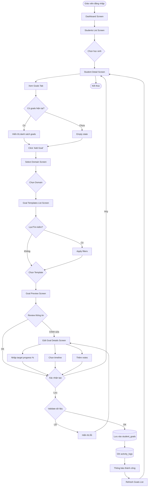
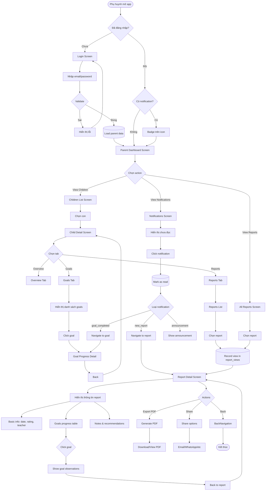

```mermaid
flowchart TD
    Start([Giáo viên đăng nhập]) --> Dashboard[Dashboard Screen]
    Dashboard --> ReportNav{Tạo báo cáo}

    ReportNav -->|Option 1| StudentList1[Từ Students List]
    ReportNav -->|Option 2| ReportsList[Từ Reports List]

    StudentList1 --> SelectStudent1[Chọn học sinh]
    SelectStudent1 --> StudentDetail1[Student Detail Screen]
    StudentDetail1 --> ClickCreateReport[Click 'Create Report']

    ReportsList --> ClickNewReport[Click 'New Report']
    ClickNewReport --> SelectStudent2[Select Student Screen]
    SelectStudent2 --> StudentDetail1

    ClickCreateReport --> CreateReportForm[Create Report Form Screen - Step 1]

    %% Step 1: Basic Info
    CreateReportForm --> InputBasicInfo[Nhập thông tin cơ bản]
    InputBasicInfo --> SessionDate[Session date]
    InputBasicInfo --> Duration[Duration minutes]
    InputBasicInfo --> Rating[Rating 1-5 stars]
    InputBasicInfo --> ParticipationLevel[Participation level]

    SessionDate --> ValidateStep1{Validate Step 1}
    Duration --> ValidateStep1
    Rating --> ValidateStep1
    ParticipationLevel --> ValidateStep1

    ValidateStep1 -->|Lỗi| ShowError1[Hiển thị lỗi]
    ShowError1 --> CreateReportForm
    ValidateStep1 -->|OK| LoadGoals[(Load student active goals)]

    %% Step 2: Select Goals
    LoadGoals --> SelectGoalsScreen[Select Goals Screen - Step 2]
    SelectGoalsScreen --> ShowActiveGoals[Hiển thị active goals]
    ShowActiveGoals --> SelectGoals{Chọn goals để đánh giá}
    SelectGoals -->|Chưa chọn| EmptyGoals[Empty state: Phải chọn ít nhất 1 goal]
    EmptyGoals --> SelectGoals
    SelectGoals -->|Đã chọn| NextToProgress[Next: Record Progress]

    %% Step 3: Record Progress
    NextToProgress --> RecordProgressScreen[Record Progress Screen - Step 3]
    RecordProgressScreen --> GoalProgress[Với mỗi goal đã chọn]

    GoalProgress --> InputProgress[Nhập progress %]
    GoalProgress --> SelectSupport[Chọn support level]
    GoalProgress --> AddObservation[Nhập observations/notes]

    InputProgress --> ValidateProgress{Validate progress data}
    SelectSupport --> ValidateProgress
    AddObservation --> ValidateProgress

    ValidateProgress -->|Lỗi| ShowError2[Hiển thị lỗi]
    ShowError2 --> RecordProgressScreen
    ValidateProgress -->|OK| NextGoal{Còn goal nào?}

    NextGoal -->|Có| GoalProgress
    NextGoal -->|Không| ReviewScreen

    %% Step 4: Review & Notes
    ReviewScreen[Review Screen - Step 4]
    ReviewScreen --> AddGeneralNotes[Thêm general notes]
    ReviewScreen --> AddRecommendations[Thêm recommendations]
    ReviewScreen --> PreviewReport[Preview toàn bộ report]

    AddGeneralNotes --> FinalReview{Review final}
    AddRecommendations --> FinalReview
    PreviewReport --> FinalReview

    FinalReview -->|Edit| BackToStep{Quay lại bước nào?}
    BackToStep -->|Step 1| CreateReportForm
    BackToStep -->|Step 2| SelectGoalsScreen
    BackToStep -->|Step 3| RecordProgressScreen

    FinalReview -->|Save as Draft| SaveDraft[(Save as 'draft')]
    FinalReview -->|Submit| SaveSubmit[(Save as 'submitted')]

    %% Save to Database
    SaveDraft --> InsertReport[(INSERT INTO reports)]
    SaveSubmit --> InsertReport

    InsertReport --> InsertReportGoals[(INSERT INTO report_goals)]
    InsertReportGoals --> UpdateStudentGoals[(UPDATE student_goals progress)]
    UpdateStudentGoals --> CheckCompleted{Goal completed?}

    CheckCompleted -->|Có| UpdateGoalStatus[(UPDATE goal status = 'completed')]
    CheckCompleted -->|Không| CreateActivityLog
    UpdateGoalStatus --> NotifyParentGoal[(Notify parent: goal completed)]
    NotifyParentGoal --> CreateActivityLog

    CreateActivityLog[(INSERT INTO activity_logs)]
    CreateActivityLog --> CheckSubmitted{Status = submitted?}

    CheckSubmitted -->|Có| NotifyParentReport[(Notify parent: new report)]
    CheckSubmitted -->|Không| SuccessMessage

    NotifyParentReport --> InsertNotification[(INSERT INTO notifications)]
    InsertNotification --> SendEmail[Send email optional]
    SendEmail --> SuccessMessage[Thông báo thành công]

    SuccessMessage --> NavigateToReport[Navigate to Report Detail]
    NavigateToReport --> End([Kết thúc])
```

# 📱 UMX - Luồng Hoạt Động & Thiết Kế Screens

**Dự án:** UMX - Student Intervention Management System  
**Ngày:** 21 tháng 10, 2025  
**Mục đích:** Tài liệu chi tiết luồng hoạt động và thiết kế màn hình

---

## 📋 Mục Lục

1. [Luồng Tạo Mục Tiêu (Create Goal)](#1-luồng-tạo-mục-tiêu)
2. [Luồng Tạo Báo Cáo (Create Report)](#2-luồng-tạo-báo-cáo)
3. [Luồng Phụ Huynh Xem Báo Cáo](#3-luồng-phụ-huynh-xem-báo-cáo)
4. [Chi Tiết Các Screens](#4-chi-tiết-các-screens)
5. [Flowchart Text Format](#5-flowchart-text-format)

---

## 1. Luồng Tạo Mục Tiêu (Create Goal)

### 🎯 Mục đích

Giáo viên gán mục tiêu (Goal) từ thư viện Goal Templates cho học sinh cụ thể.

### 📊 Flowchart Mermaid



### 🔄 Các Bước Chi Tiết

#### Bước 1: Chọn Học Sinh

- **Screen:** Students List Screen
- **Action:** Giáo viên chọn học sinh cần gán mục tiêu
- **Database Query:**
  ```sql
  SELECT s.*, u.full_name as teacher_name,
         COUNT(sg.id) as total_goals
  FROM students s
  LEFT JOIN users u ON s.primary_teacher_id = u.id
  LEFT JOIN student_goals sg ON s.id = sg.student_id
  WHERE s.status = 'active'
  GROUP BY s.id
  ```

#### Bước 2: Xem Goals Hiện Tại

- **Screen:** Student Detail Screen (Goals Tab)
- **Action:** Hiển thị danh sách goals hiện có của học sinh
- **Database Query:**
  ```sql
  SELECT sg.*, gt.description, d.name as domain_name,
         gt.difficulty_level, sg.current_progress, sg.target_progress
  FROM student_goals sg
  JOIN goal_templates gt ON sg.goal_template_id = gt.id
  JOIN domains d ON gt.domain_id = d.id
  WHERE sg.student_id = :student_id
  ORDER BY sg.start_date DESC
  ```

#### Bước 3: Chọn Domain

- **Screen:** Select Domain Screen
- **Action:** Chọn lĩnh vực mục tiêu (Imitation, Language, etc.)
- **Database Query:**
  ```sql
  SELECT id, name, description, icon, color,
         (SELECT COUNT(*) FROM goal_templates WHERE domain_id = d.id) as total_templates
  FROM domains d
  WHERE is_active = true
  ORDER BY order_index
  ```

#### Bước 4: Chọn Goal Template

- **Screen:** Goal Templates List Screen
- **Action:** Chọn mục tiêu từ thư viện templates
- **Database Query:**
  ```sql
  SELECT gt.*, d.name as domain_name,
         GROUP_CONCAT(t.name) as tags
  FROM goal_templates gt
  JOIN domains d ON gt.domain_id = d.id
  LEFT JOIN goal_template_tags gtt ON gt.id = gtt.goal_template_id
  LEFT JOIN tags t ON gtt.tag_id = t.id
  WHERE gt.domain_id = :domain_id
    AND gt.is_active = true
  GROUP BY gt.id
  ORDER BY gt.order_index
  ```

#### Bước 5: Cấu Hình Goal

- **Screen:** Edit Goal Details Screen
- **Input Fields:**
  - `target_progress`: Mục tiêu % (default 100%)
  - `start_date`: Ngày bắt đầu (default hôm nay)
  - `target_end_date`: Ngày dự kiến hoàn thành (optional)
  - `notes`: Ghi chú (optional)

#### Bước 6: Lưu Database

- **Table:** `student_goals`
- **Insert Data:**
  ```sql
  INSERT INTO student_goals (
    student_id,
    goal_template_id,
    target_progress,
    current_progress,
    status,
    start_date,
    target_end_date,
    notes,
    created_by
  ) VALUES (
    :student_id,
    :goal_template_id,
    :target_progress,
    0, -- current_progress starts at 0
    'not_started',
    :start_date,
    :target_end_date,
    :notes,
    :teacher_id
  )
  ```

#### Bước 7: Activity Log

- **Table:** `activity_logs`
- **Insert Data:**
  ```sql
  INSERT INTO activity_logs (
    user_id,
    action,
    entity_type,
    entity_id,
    new_values
  ) VALUES (
    :teacher_id,
    'create',
    'student_goal',
    :goal_id,
    :goal_data_json
  )
  ```

---

## 2. Luồng Tạo Báo Cáo (Create Report)

### 📝 Mục đích

Giáo viên tạo báo cáo tiến độ cho buổi học, cập nhật progress của các goals.

### 📊 Flowchart Mermaid



### 🔄 Các Bước Chi Tiết

#### Step 1: Basic Information

- **Screen:** Create Report Form Screen
- **Input Fields:**
  - `session_date`: Ngày buổi học (default: hôm nay)
  - `session_duration`: Thời lượng phút (default: 60)
  - `rating`: Đánh giá 1-5 sao
  - `participation_level`: High / Medium / Low
- **Validation:**
  - session_date không được là tương lai
  - session_duration > 0
  - rating trong khoảng 1-5

#### Step 2: Select Goals

- **Screen:** Select Goals Screen
- **Database Query:**
  ```sql
  SELECT sg.*, gt.description, d.name as domain_name,
         sg.current_progress, sg.target_progress,
         (SELECT progress_recorded FROM report_goals rg
          JOIN reports r ON rg.report_id = r.id
          WHERE rg.student_goal_id = sg.id
          ORDER BY r.session_date DESC LIMIT 1) as last_progress
  FROM student_goals sg
  JOIN goal_templates gt ON sg.goal_template_id = gt.id
  JOIN domains d ON gt.domain_id = d.id
  WHERE sg.student_id = :student_id
    AND sg.status IN ('not_started', 'in_progress')
  ORDER BY d.order_index, gt.order_index
  ```
- **UI Display:**
  - Checkbox list grouped by domain
  - Show current progress bar
  - Show last recorded progress
  - Minimum: phải chọn ít nhất 1 goal

#### Step 3: Record Progress

- **Screen:** Record Progress Screen
- **For each selected goal:**
  - **Display:**
    - Goal description
    - Current progress (before)
    - Last session progress
  - **Input Fields:**
    - `progress_recorded`: Progress % (0-100)
    - `support_level`: Dropdown
      - Independent
      - Verbal prompt
      - Partial physical support
      - Full physical support
      - Modeling
    - `observations`: Textarea - Quan sát chi tiết
    - `notes`: Textarea - Ghi chú bổ sung
  - **Validation:**
    - progress_recorded trong khoảng 0-100
    - Hiển thị warning nếu progress giảm

#### Step 4: Review & Notes

- **Screen:** Review Screen
- **Display:**
  - Summary của tất cả thông tin đã nhập
  - List goals với progress mới
  - Preview progress changes
- **Input Fields:**
  - `notes`: General notes về buổi học
  - `recommendations`: Khuyến nghị cho phụ huynh/buổi sau
  - `visible_to_parents`: Checkbox (default: true)
- **Actions:**
  - Save as Draft: Lưu nhưng chưa gửi
  - Submit: Lưu và gửi thông báo cho phụ huynh

#### Step 5: Save to Database

**Table 1: `reports`**

```sql
INSERT INTO reports (
  student_id,
  teacher_id,
  session_date,
  session_duration,
  rating,
  participation_level,
  notes,
  recommendations,
  status,
  visible_to_parents
) VALUES (
  :student_id,
  :teacher_id,
  :session_date,
  :session_duration,
  :rating,
  :participation_level,
  :notes,
  :recommendations,
  :status, -- 'draft' or 'submitted'
  :visible_to_parents
)
```

**Table 2: `report_goals`** (Multiple inserts)

```sql
INSERT INTO report_goals (
  report_id,
  student_goal_id,
  progress_recorded,
  previous_progress,
  notes,
  observations,
  support_level
) VALUES (
  :report_id,
  :student_goal_id,
  :progress_recorded,
  :previous_progress,
  :notes,
  :observations,
  :support_level
)
```

**Table 3: Update `student_goals`**

```sql
UPDATE student_goals
SET
  current_progress = :new_progress,
  status = CASE
    WHEN :new_progress >= target_progress THEN 'completed'
    WHEN :new_progress > 0 THEN 'in_progress'
    ELSE status
  END,
  actual_end_date = CASE
    WHEN :new_progress >= target_progress THEN CURRENT_DATE
    ELSE actual_end_date
  END,
  updated_at = CURRENT_TIMESTAMP
WHERE id = :student_goal_id
```

**Table 4: `notifications`** (if status = 'submitted')

```sql
INSERT INTO notifications (
  parent_id,
  student_id,
  type,
  title,
  message,
  related_entity_type,
  related_entity_id,
  channels,
  created_by
)
SELECT
  ps.parent_id,
  :student_id,
  'new_report',
  'Báo cáo học tập mới',
  CONCAT('Báo cáo buổi học ngày ', :session_date, ' đã được tạo cho ', s.full_name),
  'report',
  :report_id,
  '{"email": true, "push": true}',
  :teacher_id
FROM parent_students ps
JOIN students s ON ps.student_id = s.id
WHERE ps.student_id = :student_id
  AND ps.can_receive_notifications = true
```

**Table 5: `activity_logs`**

```sql
INSERT INTO activity_logs (
  user_id,
  action,
  entity_type,
  entity_id,
  new_values
) VALUES (
  :teacher_id,
  'create',
  'report',
  :report_id,
  :report_data_json
)
```

---

## 3. Luồng Phụ Huynh Xem Báo Cáo

### 👨‍👩‍👧 Mục đích

Phụ huynh đăng nhập portal, xem báo cáo và tiến độ con.

### 📊 Flowchart Mermaid



### 🔄 Các Bước Chi Tiết

#### Bước 1: Authentication

- **Screen:** Login Screen
- **Input Fields:**
  - `email`: Email phụ huynh
  - `password`: Mật khẩu
- **Database Query:**
  ```sql
  SELECT id, email, full_name, relationship, is_active,
         (SELECT COUNT(*) FROM parent_students WHERE parent_id = p.id) as children_count,
         (SELECT COUNT(*) FROM notifications WHERE parent_id = p.id AND is_read = false) as unread_notifications
  FROM parents p
  WHERE email = :email
    AND is_active = true
  ```
- **On Success:**
  - Generate JWT token
  - Update `last_login_at`
  - Navigate to Dashboard

#### Bước 2: Parent Dashboard

- **Screen:** Parent Dashboard Screen
- **Database Queries:**

  **Summary Stats:**

  ```sql
  SELECT
    COUNT(DISTINCT ps.student_id) as total_children,
    COUNT(DISTINCT r.id) as total_reports,
    COUNT(DISTINCT CASE WHEN rv.id IS NULL THEN r.id END) as unread_reports,
    COUNT(DISTINCT CASE WHEN n.is_read = false THEN n.id END) as unread_notifications
  FROM parent_students ps
  LEFT JOIN reports r ON ps.student_id = r.student_id
    AND r.visible_to_parents = true
    AND r.status = 'submitted'
  LEFT JOIN report_views rv ON r.id = rv.report_id AND rv.parent_id = :parent_id
  LEFT JOIN notifications n ON n.parent_id = :parent_id
  WHERE ps.parent_id = :parent_id
  ```

  **Recent Reports:**

  ```sql
  SELECT r.*, s.full_name as student_name, s.avatar_url,
         u.full_name as teacher_name,
         rv.viewed_at IS NOT NULL as is_viewed
  FROM reports r
  JOIN students s ON r.student_id = s.id
  JOIN users u ON r.teacher_id = u.id
  JOIN parent_students ps ON s.id = ps.student_id
  LEFT JOIN report_views rv ON r.id = rv.report_id AND rv.parent_id = :parent_id
  WHERE ps.parent_id = :parent_id
    AND r.visible_to_parents = true
    AND r.status = 'submitted'
  ORDER BY r.session_date DESC
  LIMIT 5
  ```

#### Bước 3: Children List

- **Screen:** Children List Screen
- **Database Query:**
  ```sql
  SELECT s.*, ps.relationship,
         (SELECT COUNT(*) FROM student_goals WHERE student_id = s.id AND status = 'in_progress') as active_goals,
         (SELECT COUNT(*) FROM student_goals WHERE student_id = s.id AND status = 'completed') as completed_goals,
         (SELECT COUNT(*) FROM reports WHERE student_id = s.id AND visible_to_parents = true) as total_reports,
         (SELECT AVG(rating) FROM reports WHERE student_id = s.id) as avg_rating,
         u.full_name as teacher_name
  FROM students s
  JOIN parent_students ps ON s.id = ps.student_id
  LEFT JOIN users u ON s.primary_teacher_id = u.id
  WHERE ps.parent_id = :parent_id
  ORDER BY ps.is_primary DESC, s.full_name
  ```

#### Bước 4: Report Detail

- **Screen:** Report Detail Screen
- **Database Queries:**

  **Main Report:**

  ```sql
  SELECT r.*,
         s.full_name as student_name, s.avatar_url as student_avatar,
         u.full_name as teacher_name, u.avatar_url as teacher_avatar,
         rv.viewed_at IS NOT NULL as is_viewed
  FROM reports r
  JOIN students s ON r.student_id = s.id
  JOIN users u ON r.teacher_id = u.id
  LEFT JOIN report_views rv ON r.id = rv.report_id AND rv.parent_id = :parent_id
  WHERE r.id = :report_id
    AND EXISTS (
      SELECT 1 FROM parent_students ps
      WHERE ps.parent_id = :parent_id
        AND ps.student_id = r.student_id
    )
  ```

  **Report Goals:**

  ```sql
  SELECT rg.*,
         gt.description as goal_description,
         d.name as domain_name,
         d.icon, d.color,
         sg.target_progress,
         sg.current_progress as updated_progress
  FROM report_goals rg
  JOIN student_goals sg ON rg.student_goal_id = sg.id
  JOIN goal_templates gt ON sg.goal_template_id = gt.id
  JOIN domains d ON gt.domain_id = d.id
  WHERE rg.report_id = :report_id
  ORDER BY d.order_index, gt.order_index
  ```

#### Bước 5: Record View

- **Table:** `report_views`
- **Insert (if not exists):**
  ```sql
  INSERT INTO report_views (
    report_id,
    parent_id,
    viewed_at,
    device_type
  )
  SELECT :report_id, :parent_id, CURRENT_TIMESTAMP, :device_type
  WHERE NOT EXISTS (
    SELECT 1 FROM report_views
    WHERE report_id = :report_id
      AND parent_id = :parent_id
  )
  ```

#### Bước 6: Mark Notification as Read

- **Table:** `notifications`
- **Update:**
  ```sql
  UPDATE notifications
  SET is_read = true,
      read_at = CURRENT_TIMESTAMP
  WHERE id = :notification_id
    AND parent_id = :parent_id
  ```

---

## 4. Chi Tiết Các Screens

### 📱 Teacher Screens

#### 4.1 Dashboard Screen

**Mục đích:** Tổng quan hệ thống, truy cập nhanh

**Database Queries:**

- Tổng số học sinh của giáo viên
- Số báo cáo trong tuần
- Số goals cần cập nhật
- Thống kê tổng quan

**Dữ liệu hiển thị:**

- Welcome message với tên giáo viên
- Quick stats cards
- Recent reports list
- Students need attention
- Quick action buttons

---

#### 4.2 Students List Screen

**Mục đích:** Quản lý danh sách học sinh

**Database Query:**

```sql
SELECT s.*, u.full_name as teacher_name,
       COUNT(DISTINCT sg.id) as total_goals,
       COUNT(DISTINCT CASE WHEN sg.status = 'in_progress' THEN sg.id END) as active_goals,
       COUNT(DISTINCT r.id) as total_reports,
       AVG(r.rating) as avg_rating
FROM students s
LEFT JOIN users u ON s.primary_teacher_id = u.id
LEFT JOIN student_goals sg ON s.id = sg.student_id
LEFT JOIN reports r ON s.id = r.student_id
WHERE s.status = 'active'
  AND (s.primary_teacher_id = :teacher_id OR EXISTS (
    SELECT 1 FROM student_teachers st
    WHERE st.student_id = s.id AND st.teacher_id = :teacher_id
  ))
GROUP BY s.id
ORDER BY s.full_name
```

**Filters:**

- Status: Active / Inactive / All
- Search: Tên, mã học sinh
- Sort: Name / Recent / Rating

**Dữ liệu hiển thị:**

- Avatar, tên, mã học sinh
- Tuổi, ngày nhập học
- Giáo viên chính
- Stats: Goals count, Average rating
- Quick actions: View, Edit, Create Report

---

#### 4.3 Student Detail Screen

**Mục đích:** Xem chi tiết và quản lý học sinh

**Tabs:**

1. **Overview Tab**

   - Basic info
   - Medical notes
   - Parent contact
   - Recent reports summary

2. **Goals Tab**

   - Active goals list
   - Completed goals
   - Progress charts
   - Add new goal button

3. **Reports Tab**
   - Reports history

- Filter by date range
  - Timeline view
  - Create new report button

**Database Queries:**

**Overview Tab:**

```sql
-- Student info
SELECT s.*, u.full_name as teacher_name, u.phone as teacher_phone
FROM students s
LEFT JOIN users u ON s.primary_teacher_id = u.id
WHERE s.id = :student_id

-- Recent activity
SELECT 'report' as type, r.session_date as date, r.rating, r.id
FROM reports r
WHERE r.student_id = :student_id
ORDER BY r.session_date DESC
LIMIT 5
```

**Goals Tab:**

```sql
SELECT sg.*, gt.description, d.name as domain_name, d.color, d.icon,
       sg.current_progress, sg.target_progress,
       DATEDIFF(CURRENT_DATE, sg.start_date) as days_active,
       (SELECT COUNT(*) FROM report_goals WHERE student_goal_id = sg.id) as times_practiced
FROM student_goals sg
JOIN goal_templates gt ON sg.goal_template_id = gt.id
JOIN domains d ON gt.domain_id = d.id
WHERE sg.student_id = :student_id
  AND sg.status IN ('not_started', 'in_progress', 'on_hold')
ORDER BY d.order_index, sg.start_date DESC
```

**Reports Tab:**

```sql
SELECT r.*, u.full_name as teacher_name,
       COUNT(rg.id) as goals_count
FROM reports r
JOIN users u ON r.teacher_id = u.id
LEFT JOIN report_goals rg ON r.id = rg.report_id
WHERE r.student_id = :student_id
GROUP BY r.id
ORDER BY r.session_date DESC
```

---

#### 4.4 Select Domain Screen

**Mục đích:** Chọn lĩnh vực khi tạo goal mới

**Database Query:**

```sql
SELECT d.*,
       COUNT(gt.id) as templates_count,
       COUNT(CASE WHEN gt.difficulty_level = 'easy' THEN 1 END) as easy_count,
       COUNT(CASE WHEN gt.difficulty_level = 'medium' THEN 1 END) as medium_count,
       COUNT(CASE WHEN gt.difficulty_level = 'hard' THEN 1 END) as hard_count
FROM domains d
LEFT JOIN goal_templates gt ON d.id = gt.domain_id AND gt.is_active = true
WHERE d.is_active = true
GROUP BY d.id
ORDER BY d.order_index
```

**Dữ liệu hiển thị:**

- Domain name & icon (colored)
- Description
- Số lượng templates available
- Breakdown by difficulty

**UI Layout:**

- Grid cards (2 columns on mobile)
- Large touch targets
- Visual icons for each domain

---

#### 4.5 Goal Templates List Screen

**Mục đích:** Chọn goal template từ domain đã chọn

**Database Query:**

```sql
SELECT gt.*, d.name as domain_name,
       GROUP_CONCAT(DISTINCT t.name ORDER BY t.name) as tags,
       GROUP_CONCAT(DISTINCT t.color ORDER BY t.name) as tag_colors,
       -- Check if already assigned to this student
       EXISTS(
         SELECT 1 FROM student_goals sg
         WHERE sg.goal_template_id = gt.id
           AND sg.student_id = :student_id
           AND sg.status != 'discontinued'
       ) as is_assigned
FROM goal_templates gt
JOIN domains d ON gt.domain_id = d.id
LEFT JOIN goal_template_tags gtt ON gt.id = gtt.goal_template_id
LEFT JOIN tags t ON gtt.tag_id = t.id
WHERE gt.domain_id = :domain_id
  AND gt.is_active = true
GROUP BY gt.id
ORDER BY gt.order_index
```

**Filters:**

- Difficulty level: All / Easy / Medium / Hard
- Search: Description text
- Show assigned: Hide already assigned goals

**Dữ liệu hiển thị:**

- Goal description (full text)
- Difficulty badge
- Tags (support type, etc.)
- "Already assigned" indicator
- Age range (if set)

**Actions:**

- Click card → Preview screen
- Search bar at top
- Filter chips below search

---

#### 4.6 Goal Preview Screen

**Mục đích:** Xem chi tiết goal template trước khi gán

**Database Query:**

```sql
SELECT gt.*, d.name as domain_name, d.description as domain_description,
       GROUP_CONCAT(DISTINCT t.name ORDER BY t.category, t.name) as tags,
       GROUP_CONCAT(DISTINCT t.category) as tag_categories,
       -- Similar goals already assigned
       (SELECT COUNT(*) FROM student_goals sg
        JOIN goal_templates gt2 ON sg.goal_template_id = gt2.id
        WHERE sg.student_id = :student_id
          AND gt2.domain_id = gt.domain_id
          AND sg.status IN ('in_progress', 'not_started')
       ) as similar_active_count
FROM goal_templates gt
JOIN domains d ON gt.domain_id = d.id
LEFT JOIN goal_template_tags gtt ON gt.id = gtt.goal_template_id
LEFT JOIN tags t ON gtt.tag_id = t.id
WHERE gt.id = :goal_template_id
GROUP BY gt.id
```

**Dữ liệu hiển thị:**

- Full description
- Domain info
- All tags (grouped by category)
- Difficulty & age range
- Suggested support levels
- Similar goals warning (if any)

**Actions:**

- Cancel → Back to list
- Customize → Edit Goal Details Screen
- Assign → Quick assign with defaults

---

#### 4.7 Edit Goal Details Screen

**Mục đích:** Cấu hình goal trước khi gán cho học sinh

**Input Fields:**

```json
{
  "target_progress": {
    "type": "slider",
    "min": 50,
    "max": 100,
    "default": 100,
    "step": 5,
    "label": "Target Progress (%)",
    "help": "Mục tiêu % cần đạt"
  },
  "start_date": {
    "type": "date",
    "default": "today",
    "max": "today",
    "label": "Start Date"
  },
  "target_end_date": {
    "type": "date",
    "optional": true,
    "min": "start_date",
    "label": "Target End Date",
    "help": "Dự kiến hoàn thành (optional)"
  },
  "notes": {
    "type": "textarea",
    "optional": true,
    "maxLength": 500,
    "label": "Notes",
    "placeholder": "Ghi chú đặc biệt cho mục tiêu này..."
  }
}
```

**Validation Rules:**

- target_progress: 50-100%
- start_date: Không được là tương lai
- target_end_date: Phải sau start_date
- notes: Tối đa 500 ký tự

**Preview Section:**

- Hiển thị lại goal description
- Show calculated timeline
- Estimated weekly/monthly target

**Actions:**

- Cancel → Back to preview
- Save → Insert to database + Navigate back to Student Goals Tab

---

#### 4.8 Create Report Form Screen (Step 1)

**Mục đích:** Nhập thông tin cơ bản của buổi học

**Input Fields:**

```json
{
  "session_date": {
    "type": "date",
    "required": true,
    "max": "today",
    "default": "today",
    "label": "Session Date"
  },
  "session_duration": {
    "type": "number",
    "required": true,
    "min": 15,
    "max": 300,
    "default": 60,
    "step": 15,
    "unit": "minutes",
    "label": "Duration"
  },
  "rating": {
    "type": "rating",
    "required": true,
    "min": 1,
    "max": 5,
    "label": "Overall Rating",
    "help": "Đánh giá chung về buổi học"
  },
  "participation_level": {
    "type": "select",
    "required": true,
    "options": [
      { "value": "high", "label": "Cao - Tích cực tham gia" },
      { "value": "medium", "label": "Trung bình - Đôi khi chú ý" },
      { "value": "low", "label": "Thấp - Khó tập trung" }
    ],
    "label": "Participation Level"
  }
}
```

**Student Info Display:**

```sql
SELECT s.id, s.student_code, s.full_name, s.avatar_url,
       s.date_of_birth,
       TIMESTAMPDIFF(YEAR, s.date_of_birth, CURRENT_DATE) as age
FROM students s
WHERE s.id = :student_id
```

**UI Elements:**

- Student card at top (avatar, name, age)
- Form fields with clear labels
- Helper text for each field
- Visual rating component (stars)
- Next button (validates before proceeding)

---

#### 4.9 Select Goals Screen (Step 2)

**Mục đích:** Chọn goals để đánh giá trong báo cáo

**Database Query:**

```sql
SELECT sg.*, gt.description, d.name as domain_name, d.color, d.icon,
       sg.current_progress, sg.target_progress,
       -- Last report info
       (SELECT r.session_date
        FROM reports r
        JOIN report_goals rg ON r.id = rg.report_id
        WHERE rg.student_goal_id = sg.id
        ORDER BY r.session_date DESC
        LIMIT 1) as last_reported_date,
       (SELECT rg.progress_recorded
        FROM reports r
        JOIN report_goals rg ON r.id = rg.report_id
        WHERE rg.student_goal_id = sg.id
        ORDER BY r.session_date DESC
        LIMIT 1) as last_progress
FROM student_goals sg
JOIN goal_templates gt ON sg.goal_template_id = gt.id
JOIN domains d ON gt.domain_id = d.id
WHERE sg.student_id = :student_id
  AND sg.status IN ('not_started', 'in_progress')
ORDER BY d.order_index, sg.start_date DESC
```

**UI Layout:**

- Grouped by domain (collapsible sections)
- Checkbox for each goal
- Goal card shows:
  - Description (truncated)
  - Current progress bar
  - Last session: date + progress
  - Days since last practice
- "Select All" option per domain
- Minimum 1 goal required

**Validation:**

- Must select at least 1 goal
- Warning if selecting too many (>10)

**Actions:**

- Back → Step 1
- Next → Step 3 (if valid)
- Skip goal selection → Empty state message

---

#### 4.10 Record Progress Screen (Step 3)

**Mục đích:** Ghi nhận progress cho từng goal đã chọn

**For each selected goal - Database Query:**

```sql
SELECT sg.*, gt.description, d.name as domain_name, d.color,
       sg.current_progress as before_progress,
       sg.target_progress,
       -- Progress history (last 5 sessions)
       (SELECT JSON_ARRAYAGG(
         JSON_OBJECT(
           'date', r.session_date,
           'progress', rg.progress_recorded,
           'support', rg.support_level
         )
       )
       FROM reports r
       JOIN report_goals rg ON r.id = rg.report_id
       WHERE rg.student_goal_id = sg.id
       ORDER BY r.session_date DESC
       LIMIT 5) as history
FROM student_goals sg
JOIN goal_templates gt ON sg.goal_template_id = gt.id
JOIN domains d ON gt.domain_id = d.id
WHERE sg.id = :student_goal_id
```

**Input Fields per Goal:**

```json
{
  "progress_recorded": {
    "type": "slider",
    "required": true,
    "min": 0,
    "max": 100,
    "step": 5,
    "default": "current_progress",
    "label": "Progress (%)",
    "showValue": true
  },
  "support_level": {
    "type": "select",
    "required": true,
    "options": [
      { "value": "independent", "label": "🎯 Independent", "color": "green" },
      { "value": "verbal", "label": "🗣️ Verbal Prompt", "color": "blue" },
      { "value": "modeling", "label": "👀 Modeling", "color": "purple" },
      {
        "value": "physical",
        "label": "🤝 Partial Physical",
        "color": "orange"
      },
      { "value": "full_physical", "label": "✋ Full Physical", "color": "red" }
    ],
    "label": "Support Level"
  },
  "observations": {
    "type": "textarea",
    "optional": true,
    "maxLength": 500,
    "label": "Observations",
    "placeholder": "Quan sát cụ thể trong buổi học..."
  },
  "notes": {
    "type": "textarea",
    "optional": true,
    "maxLength": 300,
    "label": "Additional Notes",
    "placeholder": "Ghi chú bổ sung..."
  }
}
```

**UI Features:**

- Swipeable cards (one goal per card)
- Progress indicator: X / Total goals
- Visual progress comparison:
  - Before: Current progress bar
  - After: New progress bar
  - Delta: +/- change indicator
- Mini chart: Last 5 sessions trend
- Auto-save draft on field blur
- Skip button (leaves goal unrecorded)

**Validation per Goal:**

- progress_recorded: 0-100
- Warning if progress decreased
- Alert if progress jumped >30%

**Navigation:**

- Previous Goal button
- Next Goal button
- Skip this Goal
- Back to Step 2
- Save & Review (when all done)

---

#### 4.11 Review Screen (Step 4)

**Mục đích:** Xem lại toàn bộ báo cáo trước khi submit

**Display Sections:**

1. **Session Summary:**

   - Date, Duration, Rating, Participation
   - Edit button → Back to Step 1

2. **Goals Progress Summary:**

   - Table/List view of all goals
   - Columns: Domain, Description, Before, After, Change, Support
   - Edit button per goal → Back to Step 3

3. **General Notes & Recommendations:**
   ```json
   {
     "notes": {
       "type": "textarea",
       "optional": true,
       "maxLength": 1000,
       "label": "General Notes",
       "placeholder": "Nhận xét chung về buổi học..."
     },
     "recommendations": {
       "type": "textarea",
       "optional": true,
       "maxLength": 500,
       "label": "Recommendations",
       "placeholder": "Khuyến nghị cho phụ huynh thực hành tại nhà..."
     },
     "visible_to_parents": {
       "type": "checkbox",
       "default": true,
       "label": "Visible to Parents",
       "help": "Phụ huynh có thể xem báo cáo này"
     }
   }
   ```

**Statistics Display:**

- Total goals recorded: X
- Average progress change: +Y%
- Goals completed in this session: Z
- Time spent: Duration

**Actions:**

- Edit Any Section button
- Save as Draft (status = 'draft')
  - No notifications sent
  - Can edit later
- Submit Report (status = 'submitted')
  - Send notifications to parents
  - Lock for editing (can only add review notes)

---

#### 4.12 Report Detail Screen (Teacher View)

**Mục đích:** Xem chi tiết báo cáo đã tạo

**Database Queries:**

**Main Report:**

```sql
SELECT r.*,
       s.full_name as student_name, s.student_code, s.avatar_url,
       u.full_name as teacher_name,
       reviewer.full_name as reviewer_name,
       COUNT(rg.id) as goals_count,
       AVG(rg.progress_recorded - rg.previous_progress) as avg_progress_change
FROM reports r
JOIN students s ON r.student_id = s.id
JOIN users u ON r.teacher_id = u.id
LEFT JOIN users reviewer ON r.reviewed_by = reviewer.id
LEFT JOIN report_goals rg ON r.id = rg.report_id
WHERE r.id = :report_id
GROUP BY r.id
```

**Report Goals:**

```sql
SELECT rg.*,
       gt.description, d.name as domain_name, d.color, d.icon,
       sg.current_progress as updated_progress,
       sg.target_progress,
       sg.status as goal_status
FROM report_goals rg
JOIN student_goals sg ON rg.student_goal_id = sg.id
JOIN goal_templates gt ON sg.goal_template_id = gt.id
JOIN domains d ON gt.domain_id = d.id
WHERE rg.report_id = :report_id
ORDER BY d.order_index
```

**Parent Views (if submitted):**

```sql
SELECT rv.*, p.full_name as parent_name, p.relationship
FROM report_views rv
JOIN parents p ON rv.parent_id = p.id
WHERE rv.report_id = :report_id
ORDER BY rv.viewed_at DESC
```

**Display Sections:**

1. Header: Student info, Date, Status badge
2. Session Info: Duration, Rating, Participation
3. Goals Table: Domain, Goal, Before, After, Change, Support
4. Observations per goal (expandable)
5. General Notes
6. Recommendations
7. Parent View Stats (if submitted)

**Actions:**

- Edit (if status = 'draft')
- Delete (if status = 'draft')
- Export PDF
- Share with parents (if not visible)
- Add Review Notes (admin only)

---

### 📱 Parent Screens

#### 4.13 Parent Login Screen

**Mục đích:** Authentication cho phụ huynh

**Input Fields:**

```json
{
  "email": {
    "type": "email",
    "required": true,
    "label": "Email",
    "autocomplete": "email"
  },
  "password": {
    "type": "password",
    "required": true,
    "label": "Password",
    "autocomplete": "current-password"
  },
  "remember_me": {
    "type": "checkbox",
    "default": false,
    "label": "Remember me"
  }
}
```

**Database Query:**

```sql
SELECT p.*,
       COUNT(DISTINCT ps.student_id) as children_count,
       COUNT(DISTINCT CASE WHEN n.is_read = false THEN n.id END) as unread_notifications
FROM parents p
LEFT JOIN parent_students ps ON p.id = ps.parent_id
LEFT JOIN notifications n ON p.id = n.parent_id
WHERE p.email = :email
  AND p.is_active = true
GROUP BY p.id
```

**On Success:**

- Update `last_login_at`
- Reset `failed_login_attempts`
- Generate JWT token (type: 'parent')
- Navigate to Dashboard

**On Failure:**

- Increment `failed_login_attempts`
- Lock account if attempts >= 5
- Show error message

**Additional Links:**

- Forgot Password
- Contact Support
- Terms & Privacy

---

#### 4.14 Parent Dashboard Screen

**Mục đích:** Trang chủ cho phụ huynh

**Database Queries:**

**Summary Stats:**

```sql
SELECT
  COUNT(DISTINCT ps.student_id) as total_children,
  COUNT(DISTINCT r.id) as total_reports,
  COUNT(DISTINCT CASE WHEN rv.id IS NULL AND r.status = 'submitted' THEN r.id END) as unread_reports,
  COUNT(DISTINCT CASE WHEN n.is_read = false THEN n.id END) as unread_notifications,
  MAX(r.session_date) as last_report_date
FROM parent_students ps
LEFT JOIN reports r ON ps.student_id = r.student_id
  AND r.visible_to_parents = true
LEFT JOIN report_views rv ON r.id = rv.report_id AND rv.parent_id = :parent_id
LEFT JOIN notifications n ON n.parent_id = :parent_id
WHERE ps.parent_id = :parent_id
```

**Recent Reports:**

```sql
SELECT r.id, r.session_date, r.rating,
       s.full_name as student_name, s.avatar_url,
       u.full_name as teacher_name,
       rv.viewed_at IS NOT NULL as is_viewed,
       COUNT(rg.id) as goals_count
FROM reports r
JOIN students s ON r.student_id = s.id
JOIN users u ON r.teacher_id = u.id
JOIN parent_students ps ON s.id = ps.student_id
LEFT JOIN report_views rv ON r.id = rv.report_id AND rv.parent_id = :parent_id
LEFT JOIN report_goals rg ON r.id = rg.report_id
WHERE ps.parent_id = :parent_id
  AND r.visible_to_parents = true
  AND r.status = 'submitted'
GROUP BY r.id
ORDER BY r.session_date DESC
LIMIT 5
```

**Recent Achievements:**

```sql
SELECT sg.actual_end_date as completed_date,
       gt.description as goal_description,
       d.name as domain_name, d.icon, d.color,
       s.full_name as student_name
FROM student_goals sg
JOIN goal_templates gt ON sg.goal_template_id = gt.id
JOIN domains d ON gt.domain_id = d.id
JOIN students s ON sg.student_id = s.id
JOIN parent_students ps ON s.id = ps.student_id
WHERE ps.parent_id = :parent_id
  AND sg.status = 'completed'
  AND sg.actual_end_date >= DATE_SUB(CURRENT_DATE, INTERVAL 30 DAY)
ORDER BY sg.actual_end_date DESC
LIMIT 5
```

**Display Sections:**

1. Welcome Header: "Xin chào, [Parent Name]"
2. Quick Stats Cards:
   - Total Children
   - Unread Reports (badge)
   - Unread Notifications (badge)
   - Last Report Date
3. Recent Reports List (with unread indicators)
4. Recent Achievements (celebrations)
5. Quick Actions: View All Children, All Reports, Notifications

**UI Features:**

- Pull to refresh
- Notification badge on icon
- Unread report highlights
- Achievement celebrations (confetti animation)

---

#### 4.15 Children List Screen (Parent)

**Mục đích:** Xem danh sách con của phụ huynh

**Database Query:**

```sql
SELECT s.*, ps.relationship, ps.is_primary,
       TIMESTAMPDIFF(YEAR, s.date_of_birth, CURRENT_DATE) as age,
       u.full_name as teacher_name, u.phone as teacher_phone,
       -- Stats
       COUNT(DISTINCT sg.id) as total_goals,
       COUNT(DISTINCT CASE WHEN sg.status = 'in_progress' THEN sg.id END) as active_goals,
       COUNT(DISTINCT CASE WHEN sg.status = 'completed' THEN sg.id END) as completed_goals,
       COUNT(DISTINCT r.id) as total_reports,
       COUNT(DISTINCT CASE WHEN rv.id IS NULL AND r.status = 'submitted' THEN r.id END) as unread_reports,
       AVG(r.rating) as avg_rating,
       MAX(r.session_date) as last_report_date
FROM students s
JOIN parent_students ps ON s.id = ps.student_id
LEFT JOIN users u ON s.primary_teacher_id = u.id
LEFT JOIN student_goals sg ON s.id = sg.student_id
LEFT JOIN reports r ON s.id = r.student_id AND r.visible_to_parents = true
LEFT JOIN report_views rv ON r.id = rv.report_id AND rv.parent_id = :parent_id
WHERE ps.parent_id = :parent_id
GROUP BY s.id
ORDER BY ps.is_primary DESC, s.full_name
```

**Display per Child:**

- Avatar, Full Name, Age
- Student Code
- Primary Teacher (name, phone)
- Stats:
  - Active Goals: X/Y
  - Average Rating: ★★★★☆
  - Unread Reports: Badge
  - Last Report: Date
- Progress indicator (overall)

**Actions:**

- Click card → Child Detail Screen
- Call teacher button
- Message teacher (if available)

---

#### 4.16 Child Detail Screen (Parent)

**Mục đích:** Xem chi tiết con

**Tabs:**

1. Overview
2. Goals
3. Reports
4. Progress

**Overview Tab - Database Query:**

```sql
-- Child info
SELECT s.*,
       TIMESTAMPDIFF(YEAR, s.date_of_birth, CURRENT_DATE) as age,
       u.full_name as teacher_name, u.phone as teacher_phone, u.email as teacher_email
FROM students s
LEFT JOIN users u ON s.primary_teacher_id = u.id
WHERE s.id = :student_id

-- Summary stats
SELECT
  COUNT(DISTINCT sg.id) FILTER (WHERE sg.status IN ('not_started', 'in_progress')) as active_goals,
  COUNT(DISTINCT sg.id) FILTER (WHERE sg.status = 'completed') as completed_goals,
  COUNT(DISTINCT r.id) as total_reports,
  AVG(r.rating) as avg_rating,
  MAX(r.session_date) as last_report_date
FROM students s
LEFT JOIN student_goals sg ON s.id = sg.student_id
LEFT JOIN reports r ON s.id = r.student_id AND r.visible_to_parents = true
WHERE s.id = :student_id
```

**Display:**

- Child photo, name, age, student code
- Enrollment info
- Teacher contact card
- Medical info (if parent_can_view_medical_notes = true)
- Summary statistics
- Recent activity timeline

**Goals Tab - Database Query:**

```sql
SELECT sg.*, gt.description, d.name as domain_name, d.color, d.icon,
       sg.current_progress, sg.target_progress,
       DATEDIFF(CURRENT_DATE, sg.start_date) as days_active,
       sg.status,
       -- Last practice
       (SELECT r.session_date
        FROM reports r
        JOIN report_goals rg ON r.id = rg.report_id
        WHERE rg.student_goal_id = sg.id
        ORDER BY r.session_date DESC
        LIMIT 1) as last_practiced
FROM student_goals sg
JOIN goal_templates gt ON sg.goal_template_id = gt.id
JOIN domains d ON gt.domain_id = d.id
WHERE sg.student_id = :student_id
ORDER BY
  CASE sg.status
    WHEN 'in_progress' THEN 1
    WHEN 'not_started' THEN 2
    WHEN 'completed' THEN 3
    ELSE 4
  END,
  d.order_index
```

**Display:**

- Grouped by domain (collapsible)
- Progress bars per goal
- Status badges
- Last practiced date
- Click goal → Goal Detail Modal

**Reports Tab:**

- Uses same query as "All Reports Screen" but filtered by student_id

**Progress Tab:**

- Overall progress chart (last 3 months)
- Domain breakdown charts
- Milestones timeline

---

#### 4.17 Report Detail Screen (Parent View)

**Mục đích:** Phụ huynh xem chi tiết báo cáo

**Database Queries:**

**Main Report:**

```sql
SELECT r.*,
       s.full_name as student_name, s.avatar_url,
       u.full_name as teacher_name, u.avatar_url as teacher_avatar,
       rv.viewed_at IS NOT NULL as is_viewed,
       rv.viewed_at as first_viewed
FROM reports r
JOIN students s ON r.student_id = s.id
JOIN users u ON r.teacher_id = u.id
LEFT JOIN report_views rv ON r.id = rv.report_id AND rv.parent_id = :parent_id
WHERE r.id = :report_id
  AND r.visible_to_parents = true
  AND r.status = 'submitted'
  AND EXISTS (
    SELECT 1 FROM parent_students ps
    WHERE ps.parent_id = :parent_id
      AND ps.student_id = r.student_id
  )
```

**Report Goals with Progress:**

```sql
SELECT rg.*,
       gt.description, d.name as domain_name, d.color, d.icon,
       rg.progress_recorded, rg.previous_progress,
       (rg.progress_recorded - rg.previous_progress) as progress_change,
       sg.target_progress, sg.current_progress as updated_progress,
       sg.status as goal_status
FROM report_goals rg
JOIN student_goals sg ON rg.student_goal_id = sg.id
JOIN goal_templates gt ON sg.goal_template_id = gt.id
JOIN domains d ON gt.domain_id = d.id
WHERE rg.report_id = :report_id
ORDER BY d.order_index
```

**On Load:**

- Insert/Update `report_views` table:

```sql
INSERT INTO report_views (report_id, parent_id, viewed_at, device_type)
VALUES (:report_id, :parent_id, CURRENT_TIMESTAMP, :device_type)
ON DUPLICATE KEY UPDATE
  viewed_at = CURRENT_TIMESTAMP,
  view_duration_seconds = view_duration_seconds + :duration
```

**Display Sections:**

1. **Header:**

   - Student name & avatar
   - Session date (with day of week)
   - Teacher name & avatar
   - Overall rating (stars)
   - "New" badge if unread

2. **Session Info Card:**

   - Duration: X minutes
   - Participation: High/Medium/Low (with icon)

3. **Goals Progress:**

   - Table/Cards grouped by domain
   - Each goal shows:
     - Description
     - Progress bar: Before → After
     - Change indicator: +X% (green) or -X% (red)
     - Support level badge
   - Click goal → Expand observations

4. **Observations per Goal (Expandable):**

   - Detailed observations
   - Additional notes
   - Support level explanation

5. **Teacher's Notes:**

   - General notes about the session
   - Recommendations for home practice

6. **Summary Stats:**
   - Total goals worked on: X
   - Average progress: +Y%
   - Goals completed: Z

**Actions:**

- Export as PDF
- Share (WhatsApp, Email)
- Print
- Mark as Favorite (future feature)

**UI Features:**

- Beautiful, clean layout
- Color-coded by domain
- Smooth animations
- Print-friendly

---

#### 4.18 Notifications Screen (Parent)

**Mục đích:** Quản lý thông báo

**Database Query:**

```sql
SELECT n.*,
       s.full_name as student_name, s.avatar_url,
       CASE
         WHEN n.related_entity_type = 'report' THEN (
           SELECT CONCAT('Báo cáo ngày ', r.session_date)
           FROM reports r WHERE r.id = n.related_entity_id
         )
         WHEN n.related_entity_type = 'goal' THEN (
           SELECT gt.description
           FROM student_goals
```

```sql
           FROM student_goals sg
           JOIN goal_templates gt ON sg.goal_template_id = gt.id
           WHERE sg.id = n.related_entity_id
         )
       END as related_entity_title
FROM notifications n
LEFT JOIN students s ON n.student_id = s.id
WHERE n.parent_id = :parent_id
ORDER BY
  CASE WHEN n.is_read = false THEN 0 ELSE 1 END,
  n.created_at DESC
LIMIT 50
```

**Display:**

- Tabs: All / Unread
- List items show:
  - Icon based on type
  - Title & message
  - Student name (if applicable)
  - Timestamp (relative: "2 hours ago")
  - Unread indicator (dot or bold text)
  - Priority badge (if urgent)

**Notification Types:**

```json
{
  "new_report": {
    "icon": "📄",
    "color": "blue",
    "title": "Báo cáo học tập mới",
    "action": "View Report"
  },
  "goal_completed": {
    "icon": "🎯",
    "color": "green",
    "title": "Mục tiêu hoàn thành",
    "action": "View Goal"
  },
  "announcement": {
    "icon": "📢",
    "color": "orange",
    "title": "Thông báo",
    "action": "View Details"
  },
  "schedule_change": {
    "icon": "📅",
    "color": "purple",
    "title": "Thay đổi lịch học",
    "action": "View Schedule"
  }
}
```

**Actions:**

- Click notification:
  - Mark as read
  - Navigate to related entity
- Swipe actions:
  - Mark as read/unread
  - Delete
- Bulk actions:
  - Mark all as read
  - Clear read notifications

**Mark as Read Query:**

```sql
UPDATE notifications
SET is_read = true,
    read_at = CURRENT_TIMESTAMP
WHERE id = :notification_id
  AND parent_id = :parent_id
```

---

#### 4.19 All Reports Screen (Parent)

**Mục đích:** Xem tất cả báo cáo của tất cả con

**Database Query:**

```sql
SELECT r.*,
       s.full_name as student_name, s.avatar_url, s.student_code,
       u.full_name as teacher_name,
       rv.viewed_at IS NOT NULL as is_viewed,
       COUNT(rg.id) as goals_count,
       AVG(rg.progress_recorded - rg.previous_progress) as avg_progress_change
FROM reports r
JOIN students s ON r.student_id = s.id
JOIN users u ON r.teacher_id = u.id
JOIN parent_students ps ON s.id = ps.student_id
LEFT JOIN report_views rv ON r.id = rv.report_id AND rv.parent_id = :parent_id
LEFT JOIN report_goals rg ON r.id = rg.report_id
WHERE ps.parent_id = :parent_id
  AND r.visible_to_parents = true
  AND r.status = 'submitted'
  AND (:student_id IS NULL OR s.id = :student_id)
  AND (:from_date IS NULL OR r.session_date >= :from_date)
  AND (:to_date IS NULL OR r.session_date <= :to_date)
  AND (:min_rating IS NULL OR r.rating >= :min_rating)
GROUP BY r.id
ORDER BY r.session_date DESC
LIMIT :limit OFFSET :offset
```

**Filters:**

- Child selector (All / Specific child)
- Date range picker
- Rating filter (All / 4-5 stars / 3+ stars / etc.)
- Status: Unread / Read / All

**Display:**

- List/Card view
- Each report card shows:
  - Student avatar & name
  - Session date
  - Rating stars
  - Goals count
  - Average progress indicator
  - Unread badge
  - Teacher name
- Pull to refresh
- Infinite scroll

**Actions per Report:**

- Click → Report Detail
- Long press → Quick actions menu:
  - Export PDF
  - Share
  - Mark as read/unread

---

#### 4.20 Goal Detail Modal (Parent)

**Mục đích:** Xem chi tiết một mục tiêu

**Database Query:**

```sql
SELECT sg.*,
       gt.description, gt.difficulty_level,
       d.name as domain_name, d.description as domain_description,
       d.color, d.icon,
       s.full_name as student_name,
       -- Progress history
       JSON_ARRAYAGG(
         JSON_OBJECT(
           'date', r.session_date,
           'progress', rg.progress_recorded,
           'support', rg.support_level,
           'notes', rg.notes
         ) ORDER BY r.session_date DESC
       ) as progress_history
FROM student_goals sg
JOIN goal_templates gt ON sg.goal_template_id = gt.id
JOIN domains d ON gt.domain_id = d.id
JOIN students s ON sg.student_id = s.id
LEFT JOIN report_goals rg ON sg.id = rg.student_goal_id
LEFT JOIN reports r ON rg.report_id = r.id
WHERE sg.id = :goal_id
  AND EXISTS (
    SELECT 1 FROM parent_students ps
    WHERE ps.parent_id = :parent_id
      AND ps.student_id = sg.student_id
  )
GROUP BY sg.id
```

**Display:**

1. **Header:**

   - Domain badge (colored)
   - Goal description
   - Status badge
   - Difficulty level

2. **Progress Section:**

   - Large circular progress chart
   - Current: X% / Target: Y%
   - Days active
   - Start date → Target end date

3. **Timeline:**

   - Progress history (last 10 sessions)
   - Date, progress %, support level
   - Visual timeline graph

4. **Details:**

   - Notes from teacher
   - Recommended home activities (if any)

5. **Celebration (if completed):**
   - Completion date
   - Congratulations message
   - Confetti animation

**Actions:**

- Close modal
- View related reports
- Share achievement (if completed)

---

## 5. Flowchart Text Format

### 5.1 Create Goal Flowchart (Text)

```
START
  ↓
[Teacher Login]
  ↓
[Dashboard] → [Students List]
  ↓
[Select Student]
  ↓
[Student Detail Screen - Goals Tab]
  ↓
[Click "Add Goal"]
  ↓
[Select Domain Screen]
  - Query: Load all active domains
  - Display: Grid of domain cards
  ↓
[User selects Domain]
  ↓
[Goal Templates List Screen]
  - Query: Load templates for selected domain
  - Filter: Difficulty, Tags, Search
  - Display: List of goal templates
  ↓
[User selects Template]
  ↓
[Goal Preview Screen]
  - Query: Load template details with tags
  - Display: Full description, tags, similar goals warning
  ↓
Decision: Customize or Quick Assign?
  ├─ Quick Assign → Go to SAVE
  └─ Customize → [Edit Goal Details Screen]
       ↓
     [Input Fields:]
       - target_progress (slider 50-100%)
       - start_date (date picker)
       - target_end_date (optional date picker)
       - notes (textarea)
       ↓
     [Validate Input]
       ↓
     Decision: Valid?
       ├─ No → Show error → Back to input
       └─ Yes → Continue
         ↓
SAVE:
  [Insert into student_goals table]
    - student_id
    - goal_template_id
    - target_progress
    - current_progress = 0
    - status = 'not_started'
    - start_date
    - target_end_date
    - notes
    - created_by = teacher_id
  ↓
  [Insert into activity_logs]
    - action = 'create'
    - entity_type = 'student_goal'
  ↓
  [Show success message]
  ↓
  [Refresh Student Goals List]
  ↓
END
```

---

### 5.2 Create Report Flowchart (Text)

```
START
  ↓
[Teacher Login]
  ↓
Decision: Entry Point?
  ├─ From Students List → [Select Student] → [Student Detail]
  └─ From Reports List → [Click "New Report"] → [Select Student Screen]
  ↓
[Student Detail] → [Click "Create Report"]
  ↓
STEP 1: BASIC INFORMATION
[Create Report Form Screen]
  ↓
  [Input Fields:]
    - session_date (default: today, max: today)
    - session_duration (default: 60, min: 15)
    - rating (1-5 stars, required)
    - participation_level (high/medium/low)
  ↓
  [Validate Step 1]
    - session_date not in future
    - duration > 0
    - rating 1-5
  ↓
  Decision: Valid?
    ├─ No → Show errors → Back to form
    └─ Yes → Continue to Step 2
      ↓
STEP 2: SELECT GOALS
[Select Goals Screen]
  ↓
  [Query: Load student active goals]
    - Status: not_started, in_progress
    - Include: current_progress, last_progress
    - Group by: domain
  ↓
  [Display: Checkbox list grouped by domain]
  ↓
  [User selects goals (minimum 1)]
  ↓
  [Validate: At least 1 goal selected?]
    ├─ No → Show warning → Stay on screen
    └─ Yes → Continue to Step 3
      ↓
STEP 3: RECORD PROGRESS
[Record Progress Screen]
  ↓
  FOR EACH selected goal:
    ↓
    [Query: Load goal details + history]
    ↓
    [Display: Goal card with progress input]
      ↓
      [Input Fields per goal:]
        - progress_recorded (slider 0-100%)
        - support_level (select dropdown)
        - observations (textarea)
        - notes (textarea)
      ↓
      [Validate progress input]
        - 0 <= progress <= 100
        - Warning if decreased
        - Alert if jump > 30%
      ↓
      Decision: Valid?
        ├─ No → Show error → Re-input
        └─ Yes → Save to temp storage
    ↓
    [Next Goal or Finish]
  ↓
STEP 4: REVIEW & NOTES
[Review Screen]
  ↓
  [Display Summary:]
    - Session info (Step 1)
    - Selected goals with progress (Step 3)
  ↓
  [Input Additional Fields:]
    - notes (general session notes)
    - recommendations (for parents/next session)
    - visible_to_parents (checkbox, default: true)
  ↓
  [Preview entire report]
  ↓
  Decision: User action?
    ├─ Edit → Go back to respective step
    ├─ Save as Draft → Set status = 'draft'
    └─ Submit → Set status = 'submitted'
  ↓
SAVE TO DATABASE:
  ↓
  [Begin Transaction]
    ↓
    [INSERT INTO reports]
      - student_id, teacher_id
      - session_date, session_duration
      - rating, participation_level
      - notes, recommendations
      - status (draft or submitted)
      - visible_to_parents
    ↓
    [Get report_id]
    ↓
    FOR EACH goal in report:
      ↓
      [INSERT INTO report_goals]
        - report_id
        - student_goal_id
        - progress_recorded
        - previous_progress
        - observations, notes
        - support_level
      ↓
      [UPDATE student_goals]
        - current_progress = new progress
        - status = 'completed' if progress >= target
        - actual_end_date = today if completed
      ↓
      Decision: Goal completed?
        └─ Yes → [CREATE notification for parent]
            - type = 'goal_completed'
    ↓
    [INSERT INTO activity_logs]
      - action = 'create'
      - entity_type = 'report'
    ↓
    Decision: Status = 'submitted'?
      └─ Yes → [CREATE notification for parent]
          - type = 'new_report'
          ↓
          [Query parent_students to get parents]
          ↓
          FOR EACH parent:
            [INSERT INTO notifications]
              - parent_id
              - student_id
              - type = 'new_report'
              - title, message
              - related_entity_type = 'report'
              - related_entity_id = report_id
              - channels = {email: true, push: true}
            ↓
            [Send email (optional)]
            [Send push notification (optional)]
  ↓
  [Commit Transaction]
  ↓
  [Show success message]
  ↓
  [Navigate to Report Detail Screen]
  ↓
END
```

---

### 5.3 Parent View Report Flowchart (Text)

```
START
  ↓
[Parent opens app]
  ↓
Decision: Authenticated?
  ├─ No → [Login Screen]
  │     ↓
  │   [Input: email, password]
  │     ↓
  │   [Validate credentials]
  │     ↓
  │   Decision: Valid?
  │     ├─ No → Show error
  │     └─ Yes → [Generate JWT token]
  │           ↓
  │           [Update last_login_at]
  │           ↓
  └─────────→ Continue
              ↓
[Load Parent Dashboard]
  ↓
  [Query: Load summary stats]
    - Total children
    - Total reports
    - Unread reports count
    - Unread notifications count
  ↓
  [Query: Recent reports (limit 5)]
  [Query: Recent achievements (limit 5)]
  ↓
  [Display Dashboard]
    - Welcome message
    - Stats cards
    - Recent reports list
    - Recent achievements
  ↓
Decision: User action?
  ├─ View Children → [Children List Screen]
  ├─ View Notifications → [Notifications Screen]
  └─ View All Reports → [All Reports Screen]
      ↓
      [Query: Load all reports]
        - Filter by: student, date, rating
        - Include: is_viewed status
        - Order by: session_date DESC
      ↓
      [Display: List of report cards]
      ↓
      [User clicks a report]
        ↓
VIEW REPORT DETAIL:
  ↓
  [Report Detail Screen]
    ↓
    [Query: Load report data]
      - Main report info
      - Student, teacher details
      - Check if already viewed
    ↓
    [Query: Load report goals]
      - All goals in this report
      - Progress before/after
      - Support levels
      - Observations
    ↓
    Decision: First time viewing?
      └─ Yes → [INSERT INTO report_views]
          - report_id
          - parent_id
          - viewed_at = now
          - device_type
    ↓
    [Display Report:]
      ↓
      [Header Section]
        - Student name & avatar
        - Session date
        - Teacher name
        - Overall rating
      ↓
      [Session Info Card]
        - Duration
        - Participation level
      ↓
      [Goals Progress Section]
        - For each goal:
          - Domain (colored badge)
          - Description
          - Progress bar: before → after
          - Change indicator (+X%)
          - Support level badge
          ↓
          [User clicks goal]
            → [Expand observations]
              - Detailed notes
              - Support explanation
      ↓
      [Teacher's Notes Section]
        - General notes
        - Recommendations
      ↓
      [Summary Stats]
        - Total goals worked
        - Average progress
        - Completed goals count
    ↓
    Decision: User action?
      ├─ Export PDF → [Generate PDF]
      │   ↓
      │   [Create PDF document]
      │   [Download/Share PDF]
      │
      ├─ Share → [Share options]
      │   ↓
      │   [WhatsApp / Email / etc.]
      │
      └─ Back → [Navigate back]
  ↓
END
```

---

## 6. Data Flow Summary

### 6.1 Create Goal Data Flow

```
Teacher Input → Validation → Database Writes → UI Update

Input Data:
  - student_id (from context)
  - goal_template_id (selected)
  - target_progress (50-100%)
  - start_date
  - target_end_date (optional)
  - notes (optional)

Database Operations:
  1. INSERT INTO student_goals
  2. INSERT INTO activity_logs

Output:
  - New goal added to student
  - Refresh goals list
  - Show success message
```

---

### 6.2 Create Report Data Flow

```
Session Info → Goal Selection → Progress Recording → Review → Database Writes → Notifications

Input Data:
  Step 1: session_date, duration, rating, participation
  Step 2: selected goal IDs (array)
  Step 3: progress data per goal (array of objects)
  Step 4: notes, recommendations, visibility

Database Operations:
  1. INSERT INTO reports
  2. INSERT INTO report_goals (multiple)
  3. UPDATE student_goals (multiple, set current_progress)
  4. UPDATE student_goals (set status = 'completed' if threshold met)
  5. INSERT INTO notifications (for parents)
  6. INSERT INTO activity_logs

Triggers:
  - If goal completed → Notify parent (goal_completed)
  - If report submitted → Notify parent (new_report)
  - Send emails (optional, async)

Output:
  - New report created
  - Goals progress updated
  - Parents notified
  - Navigate to report detail
```

---

### 6.3 Parent View Report Data Flow

```
Authentication → Load Reports → View Detail → Track View → Mark Notification

Input:
  - parent_id (from JWT)
  - report_id (selected)

Database Operations:
  1. SELECT reports + student + teacher
  2. SELECT report_goals + goal details
  3. INSERT/UPDATE report_views
  4. UPDATE notifications (mark as read)

Output:
  - Display complete report
  - Record view timestamp
  - Mark notification as read
  - Enable export/share actions
```

---

## 7. Screen-to-Database Mapping

### 7.1 Teacher Screens

| Screen                   | Tables Read                                                     | Tables Write                                                       | Key Fields                     |
| ------------------------ | --------------------------------------------------------------- | ------------------------------------------------------------------ | ------------------------------ |
| Dashboard                | students, reports, student_goals, users                         | -                                                                  | stats, summaries               |
| Students List            | students, users, student_goals, reports                         | -                                                                  | full_name, status, stats       |
| Student Detail           | students, users, student_goals, reports                         | -                                                                  | all student fields             |
| Select Domain            | domains, goal_templates                                         | -                                                                  | name, icon, color, count       |
| Goal Templates List      | goal_templates, domains, tags, student_goals                    | -                                                                  | description, tags, is_assigned |
| Edit Goal Details        | goal_templates                                                  | student_goals, activity_logs                                       | target_progress, dates, notes  |
| Create Report - Step 1   | students                                                        | -                                                                  | session_date, duration, rating |
| Select Goals - Step 2    | student_goals, goal_templates, domains                          | -                                                                  | active goals, progress         |
| Record Progress - Step 3 | student_goals, report_goals, reports                            | -                                                                  | progress_recorded, support     |
| Review - Step 4          | -                                                               | reports, report_goals, student_goals, notifications, activity_logs | all report data                |
| Report Detail            | reports, students, users, report_goals, goal_templates, domains | -                                                                  | complete report                |

---

### 7.2 Parent Screens

| Screen        | Tables Read                                                     | Tables Write                | Key Fields           |
| ------------- | --------------------------------------------------------------- | --------------------------- | -------------------- |
| Login         | parents, parent_students                                        | parents (last_login_at)     | email, password      |
| Dashboard     | parents, students, reports, report_views, notifications         | -                           | stats, recent data   |
| Children List | students, parent_students, users, student_goals, reports        | -                           | children, stats      |
| Child Detail  | students, users, student_goals, reports, report_views           | -                           | complete child info  |
| All Reports   | reports, students, users, report_views, report_goals            | -                           | all reports list     |
| Report Detail | reports, students, users, report_goals, goal_templates, domains | report_views, notifications | complete report      |
| Notifications | notifications, students                                         | notifications (is_read)     | title, message, type |

---

## 8. Validation Rules Summary

### 8.1 Create Goal Validation

```javascript
{
  student_id: "required|uuid|exists:students,id",
  goal_template_id: "required|uuid|exists:goal_templates,id",
  target_progress: "required|integer|min:50|max:100",
  start_date: "required|date|max:today",
  target_end_date: "nullable|date|after:start_date",
  notes: "nullable|string|max:500"
}
```

---

### 8.2 Create Report Validation

```javascript
// Step 1
{
  student_id: "required|uuid|exists:students,id",
  session_date: "required|date|max:today",
  session_duration: "required|integer|min:15|max:300",
  rating: "required|integer|min:1|max:5",
  participation_level: "required|in:high,medium,low"
}

// Step 2
{
  goal_ids: "required|array|min:1",
  "goal_ids.*": "uuid|exists:student_goals,id"
}

// Step 3 (per goal)
{
  student_goal_id: "required|uuid",
  progress_recorded: "required|integer|min:0|max:100",
  support_level: "required|in:independent,verbal,modeling,physical,full_physical",
  observations: "nullable|string|max:500",
  notes: "nullable|string|max:300"
}

// Step 4
{
  notes: "nullable|string|max:1000",
  recommendations: "nullable|string|max:500",
  visible_to_parents: "boolean"
}
```

---

## 9. Performance Considerations

### 9.1 Database Indexes

```sql
-- Most important indexes for performance

-- Students
CREATE INDEX idx_students_status_teacher ON students(status, primary_teacher_id);
CREATE INDEX idx_students_name_search ON students(full_name);

-- Student Goals
CREATE INDEX idx_goals_student_status ON student_goals(student_id, status);
CREATE INDEX idx_goals_template ON student_goals(goal_template_id);

-- Reports
CREATE INDEX idx_reports_student_date ON reports(student_id, session_date DESC);
CREATE INDEX idx_reports_teacher_status ON reports(teacher_id, status);
CREATE INDEX idx_reports_date_visible ON reports(session_date DESC, visible_to_parents);

-- Report Goals
CREATE INDEX idx_report_goals_composite ON report_goals(report_id, student_goal_id);

-- Notifications
CREATE INDEX idx_notifications_parent_unread ON notifications(parent_id, is_read, created_at DESC);

-- Parent Students
CREATE INDEX idx_parent_students_composite ON parent_students(parent_id, student_id);

-- Report Views
CREATE INDEX idx_report_views_composite ON report_views(report_id, parent_id);
```

---

### 9.2 Query Optimization Tips

1. **Use SELECT specific columns** instead of SELECT \*
2. **Eager load relationships** to avoid N+1 queries
3. **Paginate large lists** (limit 20-50 per page)
4. **Cache frequent queries** (domains, tags)
5. **Use database views** for complex stats
6. **Batch inserts** when creating multiple records
7. **Use transactions** for multi-table operations

---

## 10. Export/Import Considerations

### 10.1 PDF Export (Report)

**Required Data:**

- Report main info
- Student details
- Teacher details
- All goals with progress
- Observations
- Notes & recommendations
- School logo & branding

**Layout:**

- Header: School logo, report date
- Student section: Photo, name, info
- Session summary: Date, rating, duration
- Goals table: Domain, goal, before/after progress
- Notes section
- Footer: Teacher signature, date

---

### 10.2 Excel Export (Student Progress)

**Data to Export:**

- Student info
- All goals with timeline
- Progress history
- Reports summary
- Statistics

**Sheets:**

1. Overview
2. Goals Detail
3. Progress Timeline
4. Reports List

---

## 📝 Conclusion

This document provides complete flowcharts and screen specifications for the UMX system. Use this as reference when:

1. **Developing frontend screens** - Know exactly what data to fetch
2. **Creating API endpoints** - Understand the complete data flow
3. **Designing UI/UX** - Clear requirements for each screen
4. **Testing** - Validate data flow and business logic
5. **Drawing flowcharts** - Use the text format provided

**Next Steps:**

1. Create visual flowcharts using Mermaid/Lucidchart
2. Design mockups for each screen
3. Implement API endpoints
4. Build frontend screens
5. Test complete flows

---

**Document Version:** 1.0  
**Last Updated:** October 21, 2025  
**Status:** ✅ Complete & Ready for Development
